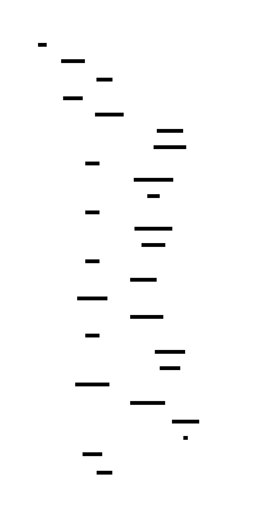

# Déclenchement manuel d'un cycle de trading

> **Statut** : Disponible
> **Commande** : `/trade`

## Résumé

Lancer `/trade` demande au bot d'analyser le marché immédiatement et, si les conditions sont favorables, de placer des ordres d'achat avec protection automatique (objectif de gain et filet de sécurité).

## Comment l'utiliser

Envoie `/trade` dans le chat Telegram avec le bot. Le bot te répond aussitôt pour confirmer que l'analyse est en cours, puis t'envoie une notification à la fin de chaque grande étape. L'ensemble du cycle dure entre 5 et 15 minutes environ.

### Séquence d'un cycle

### Les 7 phases du cycle

### Commandes Telegram

| Commande | Description | Réponse attendue |
|---|---|---|
| `/trade` | Lance un cycle d'analyse et d'exécution complet | `🔄 Cycle YYYYMMDD_HHMMSS — analyse en cours...` puis une série de notifications d'avancement |

## Cas d'usage

- **Quand** : Tu veux déclencher une analyse immédiatement sans attendre le prochain cycle automatique.
  **Résultat** : Le bot analyse le marché, sélectionne les meilleures opportunités et place des ordres si les conditions sont réunies. Tu reçois un résumé final avec le nombre d'ordres exécutés et le prochain cycle prévu.

- **Quand** : Tu as repéré un mouvement de marché inhabituel et tu veux savoir si le bot réagirait.
  **Résultat** : Le bot fait une analyse fraîche et t'explique sa décision dans le résumé final.

## Comportement en cas d'erreur

- Si un cycle est déjà en cours : `⏳ Un cycle est déjà en cours. Réessaie dans quelques minutes.`
- Si le cycle plante en cours de route : le bot envoie `❌ Cycle XXXXXX — erreur (code N)` avec les premières lignes du message d'erreur.
- Si un ordre individuel échoue sur Binance : `⚠️ OTOCO échec {COIN} : {message d'erreur}` — le cycle continue avec les autres coins.
- Si le prix d'un coin a trop bougé depuis l'analyse : `⚠️ {COIN} : prix dévié de X%, ordre annulé`.

## Limitations connues

- Un seul cycle peut tourner à la fois. Envoyer `/trade` pendant un cycle en cours ne le relancera pas.
- Le bot ne peut pas placer plus de 5 positions ouvertes simultanément (limite configurable dans `config.json`).
- Les ordres inférieurs à 11 USDC sont automatiquement ignorés (minimum Binance).
- Si le solde USDC disponible est insuffisant pour un coin, l'ordre de ce coin est sauté.

## Liens

- Doc technique : [SPEC.md](../technique/SPEC.md)
