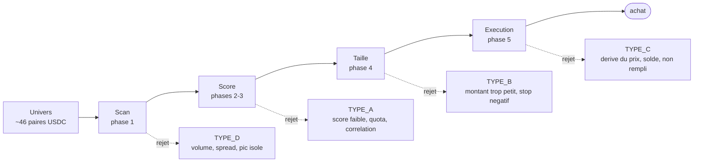
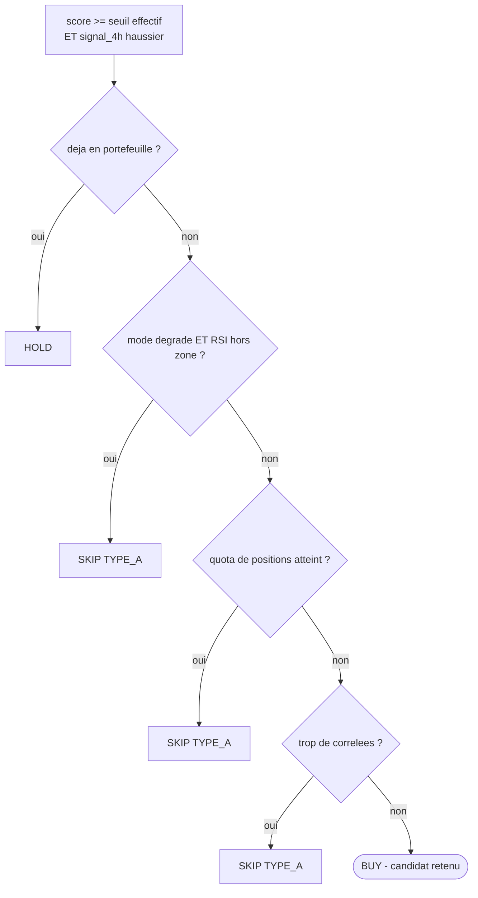
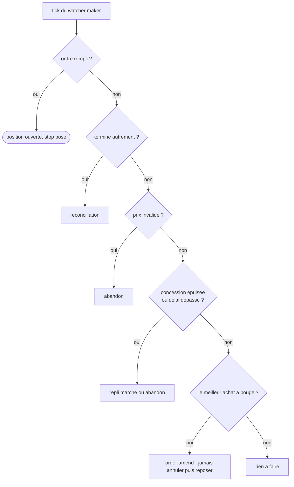

# La mécanique du bot

Toutes les quatre heures, le bot déroule huit phases : il surveille ses positions, balaie l'univers Kraken, note chaque crypto, dimensionne un ordre, l'exécute, puis consigne. Ce document décrit **ce que fait le code aujourd'hui** — chaque formule et chaque seuil vient d'une lecture du dépôt, pas d'une intention.

## Le trade qu'on va suivre

Pour que les formules ne restent pas abstraites, chacune est accompagnée du même trade réel, repris à chaque étape. Toutes les valeurs viennent de MongoDB et de `trade_history.json` — rien n'est reconstitué.

```text
[SOL · cycle du 25 août 08:05 → sortie le 27 août]

portefeuille 437,59 USDC · budget disponible 306,31 · 2 positions déjà ouvertes
univers du cycle : 4 cryptos (ETH, SOL, XBT, XRP) · sentiment Bullish
résultat : acheté à 100,25, vendu à 104,30, +3,48 USDC net après 1,03 de frais
```

Il n'a rien d'exceptionnel : un gain modeste, des frais qui pèsent, une entrée servie en ordre limite. C'est précisément pour ça qu'il est représentatif.

## Le tamis

Un cycle est d'abord un entonnoir. Sur ~46 paires USDC disponibles, quelques-unes seulement franchissent chaque filtre — et chaque sortie est étiquetée pour qu'on sache *où* l'occasion s'est perdue.



*Les quatre familles de rejet correspondent aux quatre phases où une décision peut écarter un candidat. Elles sont persistées dans MongoDB, ce qui permet de distinguer un refus stratégique d'une indisponibilité technique.*
- **TYPE_D · scan** — La paire n'existe pas en USDC, son volume est trop faible, son spread trop large, ou son volume n'est qu'un pic isolé.
- **TYPE_A · scoring** — Le signal est insuffisant, le quota de positions est atteint, ou la corrélation avec les positions existantes est excessive.
- **TYPE_B · dimensionnement** — L'ordre calculé est sous le minimum tradable, ou le stop tombe en territoire négatif.
- **TYPE_C · exécution** — Le prix a trop dérivé depuis le scan, le solde ne suffit plus, ou l'ordre n'a pas été rempli.

## Phase 0 — Avant de chercher, protéger

Le cycle commence par les positions déjà ouvertes. Cinq contrôles s'enchaînent, et le premier peut tout arrêter.

### Le coupe-circuit journalier

```text
budget_disponible = portfolio_total × usdc_allocation_pct
Si daily_pnl < −(portfolio_total × daily_loss_limit_pct) → arrêt du cycle
```

```text
[SOL · au moment du cycle]

budget_disponible = 437,59 × 0,70 = 306,31 USDC
seuil d'arrêt = −(437,59 × 0,05) = −21,88 USDC // perte du jour : 0,00 → le cycle continue
```

À 5 % du portefeuille perdu sur la journée, le bot cesse d'ouvrir des positions. C'est le seul garde-fou qui interrompt le cycle entier.

### Le recalibrage de la cible

À chaque cycle, la cible de chaque position ouverte est recalculée — le marché a bougé depuis l'achat, la résistance aussi.

```text
stop_distance_pct = (entry_price − stop_price) / entry_price
tp_mecanique = entry_price × (1 + (stop_distance_pct + fee_round_trip_pct) × reward_risk_ratio + fee_round_trip_pct)
tp_plancher = entry_price × (1 + 2 × fee_round_trip_pct)
tp_plafond = entry_price × (1 + max_tp_pct)

tp_candidat = min(tp_mecanique, tp_plafond)
Si r2_4h > entry_price → tp_candidat = min(tp_candidat, r2_4h × 0.98)
Si tp_candidat ≥ tp_plancher → tp_smart = tp_candidat
Sinon → tp_smart = tp_mecanique // un plafond sous le plancher donnerait une cible perdante

Mise à jour si |tp_smart − tp_actuel| / tp_actuel > 0.005
```

```text
[SOL · deux jours après l'achat]

Le stop suiveur a remonté le stop de 93,23 à 99,11. La distance n'est plus 7 % mais 1,137 %,
donc la cible se resserre à son tour :

tp = 100,25 × (1 + (0,01137 + 0,009) × 1,5 + 0,009) = 104,2156
plancher 102,05 < 104,22 < plafond 106,27 → conservée telle quelle

// valeur en base : 104.21562511 — la formule redonne 104,215625, zéro écart
```

> Trois plafonds se disputent la cible : le **ratio mécanique**, la **résistance 4h** et le **plafond absolu**. Le plancher les arbitre : une cible qui ne couvrirait même pas deux fois les frais n'est pas une cible, c'est une perte programmée — dans ce cas tous les plafonds sont ignorés.

### La prise de profit

```text
pnl_pct = (current_price − entry_price) / entry_price × 100
pnl_pct_net_est = pnl_pct − fee_round_trip_pct × 100
Si pnl_pct_net_est ≥ min_profit_pct_take → vente au marché // close_reason: profit_target_phase0
```

```text
[SOL · le 27 août au matin]

pnl_pct = (104,30 − 100,25) / 100,25 × 100 = +4,04 %
pnl_pct_net_est = 4,04 − 0,9 = +3,14 % // sous le seuil de 5 %
→ pas de vente anticipée ; c'est la cible qui a déclenché la sortie, pas ce contrôle
```

Une position qui dépasse 5 % de gain *net estimé* est fermée sans attendre sa cible. Les frais sont déduits avant la comparaison, sans quoi le seuil serait franchi trop tôt.

### Le stop suiveur

```text
trail_dist = entry_price − stop_actuel // la distance d'origine est conservée
new_stop = prix_courant − trail_dist

Refusé si new_stop ≤ stop_actuel + trail_dist × 0.20 // progrès trop faible
Refusé si new_stop ≥ prix_courant × 0.98 // trop collé au marché
```

```text
[SOL · le déplacement qui a eu lieu]

trail_dist = 100,25 − 93,23 = 7,02 // distance figée à l'achat
prix courant ≈ 106,13 → new_stop = 106,13 − 7,02 = 99,11

contrôle 1 : 99,11 > 93,23 + 7,02 × 0,20 = 94,63 ✓
contrôle 2 : 99,11 < 106,13 × 0,98 = 104,01 ✓ → stop déplacé
```

Le stop ne descend jamais. Il ne remonte que si le gain justifie le déplacement — au moins 20 % de la distance initiale — et jamais à moins de 2 % sous le prix courant, pour ne pas se faire sortir par une mèche.

## Phases 1-2 — Qui a le droit d'être regardé

Le scan interroge toutes les paires USDC de Kraken puis applique trois filtres successifs. Les cryptos de `portfolio_coins` franchissent tout : on veut pouvoir gérer une position même si sa liquidité s'est dégradée.

```text
spread_pct = (ask − bid) / ask
volume_24h = volume_base × prix

Rejeté si volume_24h < min_volume_usdc
Rejeté si spread_pct > max_spread_pct
Rejeté si le volume n'est pas soutenu :
sur les volume_persistence_periods dernières bougies 4h,
il faut (périodes ÷ 2 + 1) bougies au-dessus de min_volume_usdc ÷ périodes
```

```text
[SOL · phase 1 de ce cycle]

4 cryptos ont franchi les trois filtres : ETH, SOL, XBT, XRP
// XBT, XRP et SOL sont dans portfolio_coins : ils entrent quoi qu'il arrive
// ETH a donc passé volume, spread et persistance par ses propres moyens
```

> Le troisième filtre est né d'un incident. Le 22 août, TRUMP est apparu dans l'univers avec un volume multiplié par 27 en une nuit et un spread douze fois plus large que XBT. Le stop-loss a glissé de 2,3 % à l'exécution. Un volume instantané ne dit rien ; **un volume qui tient sur la majorité de six bougies** dit quelque chose.

### Ce que l'analyse extrait

Pour chaque crypto retenue, une analyse TradingView en 4h fournit le signal, le RSI, le MACD, l'ADX et les résistances. Le signal 4h est reclassé selon le RSI :

```text
signal BUY et RSI < 55 → STRONG_BUY
signal BUY et RSI ≥ 55 → BUY
signal SELL → SELL · sinon → NEUTRAL
```

L'analyse journalière n'est lancée que pour les cryptos déjà positives en 4h — c'est une économie d'appels, et la source du **mode dégradé** décrit plus bas.

## Phase 3 — La note sur dix

Huit critères, dix points possibles. Le score seul ne suffit pas : il ouvre une porte que quatre verrous peuvent refermer.

| Critère | Pts | Condition exacte |
|---|---|---|
| Signal 4h haussier | +2 | signal_4h ∈ {BUY, STRONG_BUY} |
| Signal journalier haussier | +2 | signal_1d ∈ {BUY, STRONG_BUY} |
| RSI dans la zone | +1 | `rsi_zone_min` ≤ rsi_4h ≤ `rsi_zone_max` |
| MACD haussier | +1 | macd_bullish_4h |
| Dans les plus fortes hausses | +1 | coin ∈ top_gainers |
| En cassure | +1 | coin ∈ breakout_symbols |
| Marché haussier | +1 | sentiment == "Bullish" |
| Volume remarquable | +1 | volume_24h > 2 × volume médian du cycle |

```text
[SOL · le détail de son 6/10]

signal 4h BUY +2
signal 1D BUY +2
RSI 4h = 70,74 → hors de la zone 30-65 +0
MACD haussier +1
sentiment Bullish +1
────────────────────────────────
total 6/10 · seuil 6 → tout juste retenu

// un RSI à 70,74 signale un actif déjà tendu : le point perdu est
// exactement ce qui sépare ce trade d'un signal confortable
```

### Les quatre verrous après le score



*Les verrous sont évalués dans cet ordre exact. Le troisième compte les positions déjà retenues *dans le même cycle* : sans cela, quatre candidats à 7/10 ouvriraient quatre positions alors que le quota en autorise moins.*

```text
[SOL · les verrous, un par un]

déjà en portefeuille ? non // 2 positions ouvertes, mais pas SOL
mode dégradé ? non // l'analyse 1D a répondu
quota atteint ? non // 2 ouvertes + 2 retenues = 4, pile la limite… franchi de justesse
trop de corrélées ? ETH et SOL sont tous deux du groupe → 2 sur 2 autorisées
→ BUY
```

> Ce cycle a retenu ETH puis SOL, les deux seuls membres du groupe corrélé autorisés. Un troisième — STX ou SUI — aurait été écarté en TYPE_A, quel que soit son score.

### La vente

```text
Si score ≤ 3 ET déjà en portefeuille → SELL
```

Une position dont le signal s'est effondré est vendue, indépendamment de son gain ou de sa perte. C'est le motif de sortie le plus fréquent dans l'historique.

### Le mode dégradé

Quand TradingView limite les appels, l'analyse journalière peut manquer *pour toutes* les cryptos haussières en 4h. Deux points sur dix deviennent alors inatteignables et le seuil s'abaisse :

```text
all_rl = il existe des coins BUY 4h et tous ont signal_1d indisponible
Si all_rl → seuil effectif = min_signal_score_degraded // au lieu de min_signal_score
Et le RSI cesse d'être un bonus : il devient une condition d'éligibilité
```

> Le durcissement du RSI est la contrepartie de l'abaissement du seuil. Sans confirmation journalière, on refuse d'acheter un actif suracheté — et **un RSI inconnu compte comme hors zone** : deux incertitudes ne s'annulent pas.

## Phase 4 — Combien acheter

Le dimensionnement part du risque accepté, pas du capital disponible. On décide d'abord combien on est prêt à perdre, et la quantité en découle.

```text
risk_usdc = portfolio_total × risk_per_trade_pct
stop_distance_pct = atr_pct × atr_stop_multiplier

prix_entry = prix_actuel × (1 − limit_offset_pct)
prix_stop = prix_entry × (1 − stop_distance_pct)
prix_tp = prix_entry × (1 + (stop_distance_pct + fee_round_trip_pct) × reward_risk_ratio + fee_round_trip_pct)

// plafond et plancher, comme en phase 0
prix_tp = min(prix_tp, prix_entry × (1 + max_tp_pct))
si prix_tp < prix_entry × (1 + 2 × fee_round_trip_pct) → retour au TP mécanique

quantite = risk_usdc ÷ (prix_entry × (stop_distance_pct + fee_round_trip_pct))
montant = quantite × prix_entry
```

```text
[SOL · le calcul exact du cycle]

risk_usdc = 437,59 × 0,02 = 8,7518 USDC
ATR mesuré = 2,0 % → stop_distance = 2,0 × 3,5 = 7,0 %

prix scanné = 100,0300
prix_entry = 100,03 × (1 − 0,005) = 99,52985
prix_stop = 99,52985 × (1 − 0,07) = 92,5627605
prix_tp = 99,52985 × (1 + (0,07 + 0,009) × 1,5 + 0,009) = 112,219905875

quantite = 8,7518 ÷ (99,52985 × (0,07 + 0,009)) = 1,11305582 SOL
montant = 110,78 USDC

// valeurs en base : 92.5627605 · 112.219905875 · 1.11305581
// écart sur la cible : 0,000000000 — écart sur la quantité : 1e-8 (arrondi du pas)
```

> Les frais figurent **trois fois** dans ces formules, et ce n'est pas une redondance. Dans la cible, ils garantissent que le ratio de 1,5 porte sur un gain **net**. Dans le dénominateur de la quantité, ils garantissent que la perte réelle au stop — glissement *plus* frais — reste dans le budget de risque. Avant août, les frais étaient absents partout : le ratio affiché de 2,0 valait 1,2 en réalité.

### Les bornes appliquées ensuite

```text
Rejeté si prix_stop ≤ 0 // volatilité extrême → TYPE_B
Rejeté si montant < min_order_usdc // → TYPE_B
Écrêté si montant > budget_disponible × max_single_position_pct

// puis les contraintes propres à la paire, lues chez Kraken
quantite arrondie vers le bas au pas lot_decimals
Rejeté si quantite < ordermin ou montant < costmin
```

```text
[SOL · les bornes ne mordent pas]

montant 110,78 > 9 → passe le minimum
plafond = 306,31 × 0,65 = 199,10 → 110,78 < 199,10, pas d'écrêtage
prix_stop 92,56 > 0 → pas de skip TYPE_B
```

```text
[Contre-exemple · TRUMP du 22 août, avant les corrections]

stop_distance = 7,0 % — identique à SOL
prix_tp = 2,496 × (1 + 2 × 0,07) = 2,8454 // ancienne formule : ratio 2, aucun frais
quantite = 9,22 ÷ (2,496 × 0,07) = 52,76 // pas de frais au dénominateur

— avec la configuration d'aujourd'hui —
tp mécanique = 2,496 × (1 + (0,07 + 0,009) × 1,5 + 0,009) = 2,8147 (+12,8 %)
plafond = 2,496 × (1 + 0,06) = 2,6458 (+6,0 %) → le plafond s'applique
quantite = 9,22 ÷ (2,496 × 0,079) = 46,68 // 12 % de moins

résultat réel : stop touché, −13,20 USDC, la plus grosse perte de l'historique
```

> La cible en base pour TRUMP vaut `2.8454399276`, soit **exactement** l'entrée majorée de 14 %. Aucun frais nulle part. Le plafond ramènerait aujourd'hui cette cible à +6 %, une hauteur que le marché atteint réellement : la mesure faite sur l'historique donne une hausse médiane de 4,9 % pendant la détention, et **sur 43 cibles fixées au-delà de 8 %, 2 seulement ont été touchées** — la plus haute atteinte est à +11,27 %. Je ne peux pas affirmer que ce trade serait devenu gagnant — il est descendu au stop en moins de quatre heures — mais sa cible aurait été atteignable au lieu d'être hors de portée par construction.

## Phase 5 — Passer l'ordre sans payer le prix fort

Chez Kraken, le tarif preneur est le double du tarif apporteur — 0,60 % contre 0,30 % au palier actuel. Depuis août, le bot entre systématiquement en ordre limite pour rester du bon côté.

```text
drift = |prix_refetch − prix_entry| / prix_entry
Rejeté si drift > price_deviation_max_pct // → TYPE_C
Rejeté si solde USDC insuffisant // → TYPE_C
```

```text
[SOL · l'exécution]

ordre limite post-only posé au meilleur achat
servi après 141 secondes, à 100,25 — au-dessus des 99,53 planifiés
// l'ordre est posé au bid du moment de l'exécution, pas au prix de planification

frais d'entrée 0,33 USDC en tarif apporteur
// au tarif preneur, la même entrée aurait coûté ~0,67 : 0,34 USDC économisés
```

L'ordre est ensuite posé en `limit --oflags post` au meilleur achat. Le drapeau `post` garantit le tarif apporteur : si l'ordre était exécutable immédiatement, Kraken le rejette au lieu de le passer en preneur.

### Le suivi de l'ordre, toutes les 20 secondes



*L'ordre est *modifié*, jamais annulé puis reposé : annuler ferait perdre l'antériorité dans le carnet d'ordres, donc les chances d'être servi.*

> La distinction entre le troisième et le quatrième cas est le cœur de la stratégie. Si le **prix s'est invalidé**, la raison d'acheter a disparu : on renonce. Si seul le **temps** ou le **budget de concession** est épuisé, la raison d'acheter tient toujours : on paie le tarif preneur plutôt que de rater le trade.

```text
[SOL · la sortie, deux jours plus tard]

prix atteint 104,30 ≥ cible 104,2156 → vente déclenchée par le watcher

gain brut = (104,30 − 100,25) × 1,113 = +4,51 USDC
frais = 0,33 (entrée, apporteur) + 0,70 (sortie, preneur) = −1,03
────────────────────────────────
gain net = +3,48 USDC // les frais ont pris 23 % du gain brut
```

> La sortie est un ordre au marché : elle paie le tarif preneur, deux fois plus cher que l'entrée. C'est l'objet du chantier suivant — appliquer la même stratégie d'ordre limite aux sorties.

Le délai de soixante minutes semblait généreux — cinq minutes avaient été envisagées. Les cinq remplissages observés ont pris 94, 105, 110, 141 et **405 secondes**. Avec un délai court, le dernier serait parti au marché et aurait payé double.

## Le rôle de chaque réglage

Trente-six clés dans `config.json`. Voici où chacune agit, et ce qu'elle déplace.

### Risque et dimensionnement

| Réglage | Valeur | Où | Ce qu'il fait |
|---|---|---|---|
| risk_per_trade_pct | 0.02 | phase 4 | Part du portefeuille risquée par trade. Fixe `risk_usdc`, donc la quantité. |
| atr_stop_multiplier | 1.75 | phase 4 | Largeur du stop en multiples d'ATR. Plus il est grand, plus le stop est loin — et plus la quantité est faible. |
| reward_risk_ratio | 1.5 | phases 0 et 4 | Gain net visé rapporté à la perte nette. Porte sur du net depuis août. |
| fee_round_trip_pct | 0.009 | phases 0, 4, 5 | Coût aller-retour estimé. Entre dans la cible, dans la quantité et dans la prise de profit. |
| max_tp_pct | 0.06 | phases 0 et 4 | Plafond absolu de la cible. Le marché a délivré 4,9 % en médiane pendant la détention ; viser plus revenait à ne jamais toucher. |
| usdc_allocation_pct | 0.70 | phase 0 | Part du solde USDC mobilisable. |
| max_single_position_pct | 0.65 | phase 4 | Plafond d'une position seule, en part du budget disponible. |
| min_order_usdc | 9 | phase 4 | Montant minimal d'un ordre. En dessous, skip TYPE_B. |
| limit_offset_pct | 0.005 | phase 4 | Décote appliquée au prix de référence pour calculer le prix d'entrée. |
| daily_loss_limit_pct | 0.05 | phase 0 | Perte journalière au-delà de laquelle le cycle s'arrête. |

### Sélection et signal

| Réglage | Valeur | Où | Ce qu'il fait |
|---|---|---|---|
| min_signal_score | 6 | phase 3 | Score minimal pour acheter, sur 10. |
| min_signal_score_degraded | 4 | phase 3 | Seuil de repli quand l'analyse journalière est indisponible pour toutes les cryptos haussières. |
| rsi_zone_min / max | 30 / 65 | phase 3 | Zone RSI qui donne un point. En mode dégradé, sortir de la zone devient éliminatoire. |
| max_open_positions | 4 | phase 3 | Nombre de positions simultanées. Compte aussi les candidats retenus dans le cycle en cours. |
| max_correlated_positions | 2 | phase 3 | Plafond de positions dans le groupe SOL · SUI · STX · ETH. |
| min_volume_usdc | 500 000 | phase 1 | Volume 24h minimal pour entrer dans l'univers. |
| max_spread_pct | 0.0008 | phase 1 | Écart achat-vente maximal. Relevé de 0,05 % à 0,08 % : ADA était exclue pour quatre millièmes de point. |
| volume_persistence_periods | 6 | phase 1 | Nombre de bougies 4h sur lesquelles le volume doit tenir. Écarte les pics isolés. |
| portfolio_coins | XBT XRP SOL | phase 1 | Cryptos toujours incluses dans l'univers, quels que soient les filtres. |

### Exécution et sorties

| Réglage | Valeur | Où | Ce qu'il fait |
|---|---|---|---|
| maker_entry_enabled | true | phase 5 | Active l'entrée en ordre limite. À false, retour au marché direct. |
| maker_tick_seconds | 20 | watcher | Fréquence de réévaluation de l'ordre en attente. |
| maker_max_concession_pct | 0.003 | watcher | Budget de poursuite du prix. Épuisé, l'ordre bascule au marché. |
| maker_timeout_seconds | 3600 | watcher | Délai maximal de chasse. Un remplissage à 405 s a validé ce choix. |
| price_deviation_max_pct | 0.02 | phase 5, watcher | Dérive de prix tolérée. Dépassée, la thèse du trade est considérée morte. |
| min_profit_pct_take | 5.0 | phase 0 | Gain net déclenchant une vente anticipée, sans attendre la cible. |
| max_oco_retry | 3 | phase 0 | Tentatives de repose d'une protection OCO manquante. |
| max_hold_days | 14 | hors cycle | Durée de détention maximale — n'agit que dans le flux de gestion de position, pas dans le cycle de trading. |
| display_timezone | Europe/Paris | affichage | Fuseau de tout affichage. L'interne reste en UTC. |

### Cinq réglages qui ne servent à rien

Ils figurent dans `config.json` mais aucun code ne les lit. Les modifier n'a aucun effet.

| Réglage | Valeur | Ce qu'on croirait qu'il fait |
|---|---|---|
| min_adx | 20 | Filtrer sur la force de tendance. L'ADX est bien lu en phase 2, mais aucun seuil ne l'utilise. |
| timeframes_required | ["4h"] | Choisir les horizons analysés. Ils sont écrits en dur. |
| universe_scan_top_n | 20 | Limiter l'univers scanné. Le scan prend toutes les paires USDC. |
| usdc_blacklist | [] | Exclure des cryptos. Aucune exclusion n'est appliquée. |
| approval_timeout_minutes | 30 | Délai d'approbation manuelle. Vestige d'un flux abandonné. |

> Ces clés ne sont pas dangereuses, mais elles sont **trompeuses** : lire `min_adx: 20` laisse croire qu'un filtre de tendance protège les entrées. Il n'y en a pas.

## Septembre — Ce que la configuration produit vraiment

> **Errata du 07/09.** Une première version de cette section, publiée quelques heures plus tôt, annonçait des ratios trop favorables : le calcul oubliait de retrancher les frais de sortie du gain. Les valeurs ci-dessous sont corrigées et vérifiées par un contrôle simple — sans plafond, la formule doit redonner exactement le `reward_risk_ratio` configuré, soit 1,50. C'est désormais le cas.

Les formules ci-dessus sont justes, mais elles cachent une conséquence que personne n'avait calculée : **le plafond de la cible annule le ratio que le dimensionnement cherche à obtenir**. Cette section est un ajout du 07/09, écrit après une mesure sur les 43 trades ouverts depuis le 1er août.

### Le ratio est de l'arithmétique pure

Le gain visé et le risque se ramènent tous deux à un pourcentage de l'entrée, et la quantité s'ajuste au budget de risque. Le rapport entre les deux ne dépend donc que de la distance du stop et du plafond — aucune donnée de marché n'entre dans ce calcul.

```text
perte au stop = risk_usdc // par construction : le dimensionnement l'y ramène
gain à la cible = risk_usdc × (tp_pct − fee_round_trip_pct) ÷ (sd + fee_round_trip_pct)

ratio = (tp_pct − fee_round_trip_pct) ÷ (sd + fee_round_trip_pct)
avec tp_pct = min( (sd + F) × reward_risk_ratio + F , max_tp_pct )
// sd = distance du stop = atr_pct × atr_stop_multiplier
// contrôle : sans plafond, la formule redonne exactement 1,50 — le reward_risk_ratio
```

En résolvant l'égalité, on obtient le point exact où le plafond commence à mordre :

```text
[le seuil de bascule]

le plafond commence à mordre dès que le stop dépasse 2,50 % (ATR au-dessus de 0,71 %)
le gain visé tombe sous le risque dès que le stop dépasse 4,20 %
// soit exactement max_tp_pct − 2 × fee_round_trip_pct

// sur du 4h en crypto, l'ATR médian mesuré par le bot est de 1,73 %
// le plafond mord donc sur la quasi-totalité des trades
```

### Le tableau complet

| ATR mesuré | Stop (×3,5) | Plafond 6 % | Plafond 8 % | Plafond 10 % |
|---|---|---|---|---|
| 0,71 % | 2,5 % | 1,50 | 1,50 | 1,50 |
| 1,00 % | 3,5 % | 1,15 | 1,50 | 1,50 |
| 1,50 % | 5,2 % | 0,82 | 1,15 | 1,48 |
| **1,73 %** — la médiane réelle | **6,1 %** | **0,73** | 1,02 | 1,31 |
| 2,50 % | 8,8 % | 0,52 | 0,73 | 0,93 |
| 4,00 % | 14,0 % | 0,34 | 0,47 | 0,61 |

> Sur les **43 trades ouverts depuis le 1er août**, **39 risquent plus qu'ils ne visent** — soit 91 %. Le ratio médian net est de **0,73**, là où la configuration croit demander 1,5. Autrement dit : le bot mise 100 pour espérer 73.

### Comment ces distances ont été retrouvées

Le champ `stop_price` de l'historique ne convient pas : le stop suiveur le réécrit à chaque cycle, au point que certaines positions affichent un stop *au-dessus* de leur prix d'entrée. La quantité, elle, est figée à l'achat, ce qui permet d'inverser la formule de dimensionnement :

```text
sd_origine = risk_usdc ÷ (entry_price × quantity) − fee_round_trip_pct
```

```text
[contrôle de la méthode]

sur les 8 trades dont le stop n'a jamais été déplacé, la reconstitution
tombe à 0,06 point près de la valeur enregistrée

// sur les 34 autres, l'écart mesure le déplacement du stop suiveur, pas une erreur
```

### Les deux leviers

Le plafond restant à 6 %, voici ce que donne chaque multiplicateur sur les 43 trades. La bascule est brutale entre 2,43 et 2,0 parce que les ATR mesurés sont très resserrés — premier quartile 1,67 %, troisième 1,74 % — donc les trades franchissent le seuil presque tous ensemble.

| atr_stop_multiplier | Stop médian | Ratio net médian | Risque > gain |
|---|---|---|---|
| 3,5 — d'origine | 6,07 % | **0,73** | 39/43 |
| 3,0 | 5,20 % | 0,84 | 35/43 |
| 2,5 | 4,34 % | 0,97 | 32/43 |
| 2,43 — parité exacte | 4,21 % | 1,00 | 29/43 |
| 2,0 | 3,47 % | **1,17** | 5/43 |
| **1,75 — retenu le 07/09** | **3,03 %** | **1,30** | **5/43** |

### Pourquoi c'est le stop qu'il faut regarder, pas le plafond

Relever le plafond répare le ratio sur le papier. Mais il faut alors que le marché aille chercher ces cibles, et l'historique est mesurable sur ce point :

```text
[89 ventes · ce que le marché a réellement donné]

hausse à la sortie, sur les 47 sorties au-dessus de l'entrée :
médiane +3,23 % · troisième quartile +5,91 %

cibles fixées au-delà de +8 % : 43 · réellement atteintes : 2
cible la plus haute jamais touchée : +11,27 %

// une cible au-delà de 8 % est atteinte environ une fois sur vingt
```

> Le plafond de 6 % tombe donc à peu près au troisième quartile de la hausse réellement observée : **il est bien placé**. C'est la distance du stop — 6,07 % en médiane — qui est disproportionnée face à un mouvement dont la taille habituelle est de 3,2 %. Le bot risque six pour aller chercher trois. **Le levier le plus sûr est le multiplicateur du stop, pas le plafond de la cible.**

### Le poids des frais

```text
[87 ventes dont le brut et le net sont connus]

gain cumulé sur les prix +42,42 USDC
frais payés −68,51 USDC
─────────────────────────
résultat net −26,09 USDC

11 ventes sur 87 ont été gagnantes au prix et perdantes après frais :
+2,98 de gain sur les prix devenus −6,35 encaissés
```

Les choix d'entrée et de sortie sont donc collectivement gagnants. Ce sont les frais — une fois et demie le gain brut — qui rendent le bilan négatif. Un ratio gain/risque inférieur à 1 et des frais de cet ordre se combinent : chaque trade doit franchir 0,9 % de frais avant d'exister, et vise un gain plafonné sous son propre risque.

### Ce qui a été décidé le 07/09

`atr_stop_multiplier` est passé de **3,5 à 1,75**. Le plafond `max_tp_pct` n'a pas été touché : la hausse médiane réellement observée à la sortie est de +3,23 % et son troisième quartile de +5,91 %, donc 6 % est bien placé. C'était la distance du stop qui était disproportionnée.

```text
[effet du changement]

stop médian 6,07 % → 3,03 %
ratio net 0,73 → 1,30
trades défavorables 39/43 → 5/43
```

> Deux contreparties assumées. **Le stop passe sous le mouvement médian** (3,03 % contre 3,23 % de hausse médiane à la sortie) : il se trouve désormais dans la zone où le prix respire, donc davantage de sorties possibles sur du bruit — non mesurable ici, voir ci-dessous. Et **le capital engagé par position dépasse le plafond** `max_single_position_pct` : à risque constant, un stop plus serré agrandit la position (211,68 USDC calculés contre 189,13 autorisés au portefeuille du 07/09), qui sera donc écrêtée. Ce n'est plus le budget de risque qui pilote la taille, mais le plafond de position — le risque réel par trade descend sous les 2 % annoncés.

### Ce que cette mesure ne dit pas

> Tout ce qui précède est de l'arithmétique sur des réglages, pas une simulation de résultat. **Je n'ai pas le chemin des prix** entre l'entrée et la sortie de chaque trade — seulement les deux extrémités. Impossible, donc, de dire si un stop plus serré aurait été touché avant que le trade ne parte dans le bon sens : resserrer le stop améliore le ratio par construction, mais augmente la probabilité d'être sorti par du bruit, et cette probabilité-là n'est pas mesurable ici. Répondre demanderait de rejouer les bougies 4h de chaque détention. Les chiffres ci-dessus disent **ce que la configuration promet**, pas ce qu'elle aurait rapporté.
---

*Source : docs/strategie.html · le markdown docs/strategie.md en est généré par scripts/strategie_to_md.py*
