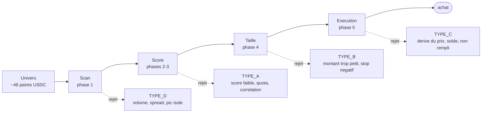
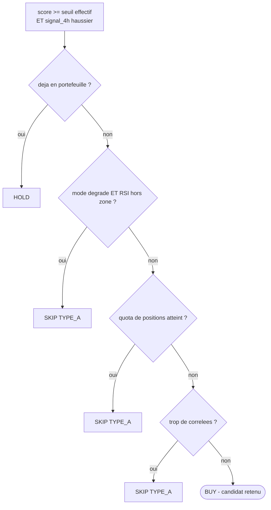
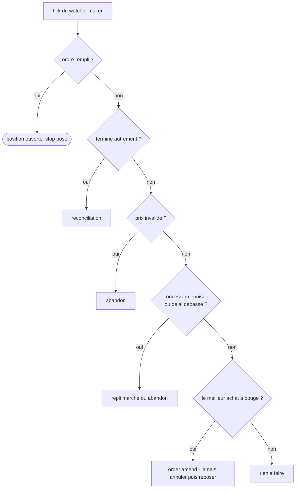

# La mécanique du bot

Toutes les quatre heures, le bot déroule huit phases : il surveille ses positions, balaie l'univers Kraken, note chaque crypto, dimensionne un ordre, l'exécute, puis consigne. Ce document décrit **ce que fait le code aujourd'hui** — chaque formule et chaque seuil vient d'une lecture du dépôt, pas d'une intention.

## Le trade qu'on va suivre

Pour que les formules ne restent pas abstraites, chacune est accompagnée du même trade réel, repris à chaque étape. Toutes les valeurs viennent de MongoDB et de `trade_history.json` — rien n'est reconstitué.

```text
[SOL · cycle du 25 août 08:05 → sortie le 27 août]

portefeuille 437,59 USDC · budget disponible 306,31 · 2 positions déjà ouvertes
univers du cycle : 4 cryptos (ETH, SOL, XBT, XRP) · sentiment Bullish
résultat : acheté à 100,25, vendu à 104,30, +3,48 USDC net après 1,03 de frais
```

Il n'a rien d'exceptionnel : un gain modeste, des frais qui pèsent, une entrée servie en ordre limite. C'est précisément pour ça qu'il est représentatif.

## Le tamis

Un cycle est d'abord un entonnoir. Sur ~46 paires USDC disponibles, quelques-unes seulement franchissent chaque filtre — et chaque sortie est étiquetée pour qu'on sache *où* l'occasion s'est perdue.


```mermaid
flowchart LR
  U["Univers<br/>~46 paires USDC"] --> S["Scan<br/>phase 1"]
  S --> A["Score<br/>phases 2-3"]
  A --> T["Taille<br/>phase 4"]
  T --> E["Execution<br/>phase 5"]
  E --> OK(["achat"])
  S -. rejet .-> D["TYPE_D<br/>volume, spread, pic isole"]
  A -. rejet .-> B["TYPE_A<br/>score faible, quota, correlation"]
  T -. rejet .-> C["TYPE_B<br/>montant trop petit, stop negatif"]
  E -. rejet .-> F["TYPE_C<br/>derive du prix, solde, non rempli"]
```

*Les quatre familles de rejet correspondent aux quatre phases où une décision peut écarter un candidat. Elles sont persistées dans MongoDB, ce qui permet de distinguer un refus stratégique d'une indisponibilité technique.*
- **TYPE_D · scan** — La paire n'existe pas en USDC, son volume est trop faible, son spread trop large, ou son volume n'est qu'un pic isolé.
- **TYPE_A · scoring** — Le signal est insuffisant, le quota de positions est atteint, la corrélation avec les positions existantes est excessive, ou la hausse du prix sur 24h dépasse le seuil de poursuite.
- **TYPE_B · dimensionnement** — L'ordre calculé est sous le minimum tradable, ou le stop tombe en territoire négatif.
- **TYPE_C · exécution** — Le prix a trop dérivé depuis le scan, le solde ne suffit plus, ou l'ordre n'a pas été rempli.

## Phase 0 — Avant de chercher, protéger

Le cycle commence par les positions déjà ouvertes. Cinq contrôles s'enchaînent, et le premier peut tout arrêter.

### Le coupe-circuit journalier

```text
budget_disponible = portfolio_total × usdc_allocation_pct
Si daily_pnl < −(portfolio_total × daily_loss_limit_pct) → arrêt du cycle
```

```text
[SOL · au moment du cycle]

budget_disponible = 437,59 × 0,70 = 306,31 USDC
seuil d'arrêt = −(437,59 × 0,05) = −21,88 USDC // perte du jour : 0,00 → le cycle continue
```

À 5 % du portefeuille perdu sur la journée, le bot cesse d'ouvrir des positions. C'est le seul garde-fou qui interrompt le cycle entier.

### Le recalibrage de la cible

À chaque cycle, la cible de chaque position ouverte est recalculée — le marché a bougé depuis l'achat, la résistance aussi. La résistance est le **plus haut des `resistance_lookback_4h` dernières bougies 4h Kraken clôturées** (30 par défaut, environ cinq jours) ; la bougie en cours est exclue, son plus haut n'est pas figé. Aucun appel TradingView : si Kraken ne répond pas pour un coin, la cible existante est conservée.

```text
stop_distance_pct = (entry_price − stop_origine) / entry_price // stop d'origine, jamais le stop courant (#513)
tp_mecanique = entry_price × (1 + (stop_distance_pct + fee_round_trip_pct) × reward_risk_ratio + fee_round_trip_pct)
tp_plancher = entry_price × (1 + 2 × fee_round_trip_pct)
tp_plafond = entry_price × (1 + max_tp_pct)

tp_candidat = min(tp_mecanique, tp_plafond)
resistance = max(high des resistance_lookback_4h dernières bougies 4h clôturées)
Si resistance > entry_price et resistance × 0.98 < tp_plancher → tp_smart = tp_plancher // résistance trop proche : la cible est le plancher (#519)
Si resistance > entry_price et resistance × 0.98 ≥ tp_plancher → tp_smart = min(tp_candidat, resistance × 0.98)
Sinon (résistance absente ou ≤ entry_price) → tp_smart = tp_candidat // plafond max_tp_pct conservé : jamais de cible non plafonnée (#516)

Mise à jour si |tp_smart − tp_actuel| / tp_actuel > 0.005
```

```text
[SOL · deux jours après l'achat]

Le stop suiveur a remonté le stop de 93,23 à 99,11. Avec la distance du stop courant (1,137 %),
la cible se resserrait mécaniquement — comportement antérieur au ticket #513 :

tp = 100,25 × (1 + (0,01137 + 0,009) × 1,5 + 0,009) = 104,2156 // valeur en base : 104.21562511

Avec la distance du stop d'origine (93,23 → 7,002 %), la cible reste celle de l'achat :
tp_mecanique = 100,25 × (1 + (0,07002 + 0,009) × 1,5 + 0,009) = 113,04 → plafonné à 106,27 (max_tp_pct)
plancher 102,05 < 106,27 → cible 106,27
```

Le stop d'origine est le champ `initial_stop_price`, posé à l'entrée. Pour les trades antérieurs il est reconstruit : `stop_origine = entry × (1 − (risk_usdc / (entry × quantité) − fee_round_trip_pct))`, la formule inverse du dimensionnement (cf. section Septembre).

> Trois plafonds se disputent la cible : le **ratio mécanique**, la **résistance 4h** et le **plafond absolu**. Le plancher arbitre la résistance : une résistance qui ne laisserait même pas deux fois les frais n'est pas une cible de plus haut : la cible devient le plancher lui-même (#519), sans repartir vers le plafond absolu. La même règle (`compute_tp_target`) sert à l'entrée (phases 4 et 5, suivi maker) et au recalibrage.

### La prise de profit

```text
pnl_pct = (current_price − entry_price) / entry_price × 100
pnl_pct_net_est = pnl_pct − fee_round_trip_pct × 100
Si pnl_pct_net_est ≥ min_profit_pct_take → vente au marché // close_reason: profit_target_phase0
```

```text
[SOL · le 27 août au matin]

pnl_pct = (104,30 − 100,25) / 100,25 × 100 = +4,04 %
pnl_pct_net_est = 4,04 − 0,9 = +3,14 % // sous le seuil de 5 %
→ pas de vente anticipée ; c'est la cible qui a déclenché la sortie, pas ce contrôle
```

Une position qui dépasse 5 % de gain *net estimé* est fermée sans attendre sa cible. Les frais sont déduits avant la comparaison, sans quoi le seuil serait franchi trop tôt.

### Le stop suiveur

```text
trail_dist = entry_price − stop_origine // la distance d'origine est conservée (#513 : plus stop_actuel)
new_stop = prix_courant − trail_dist

Refusé si new_stop ≤ stop_actuel + trail_dist × 0.20 // progrès trop faible
Refusé si new_stop ≥ prix_courant × 0.98 // trop collé au marché
```

```text
[SOL · le déplacement qui a eu lieu]

trail_dist = 100,25 − 93,23 = 7,02 // distance figée à l'achat (stop d'origine)
prix courant ≈ 106,13 → new_stop = 106,13 − 7,02 = 99,11

contrôle 1 : 99,11 > 93,23 + 7,02 × 0,20 = 94,63 ✓
contrôle 2 : 99,11 < 106,13 × 0,98 = 104,01 ✓ → stop déplacé
```

Le stop ne descend jamais. Il ne remonte que si le gain justifie le déplacement — au moins 20 % de la distance initiale — et jamais à moins de 2 % sous le prix courant, pour ne pas se faire sortir par une mèche.

> Avec le stop de départ à −20 % (#521), `trail_dist` vaut 20 % de l'entrée : une fois le stop au break-even, le suiveur n'avance qu'au-delà de +24,9 %, au-dessus de la cible (+6 % au plus). Il est donc quasi inactif, sans modification de code.

> Depuis le ticket #513 la distance est mesurée sur le stop *d'origine*. Avec l'ancienne formule (`entry − stop_actuel`), un stop remonté au-dessus du prix d'entrée donnait `trail_dist ≤ 0` et le stop suiveur ne bougeait plus jamais.

### Le break-even

```text
déclencheur = entry_price × (1 + breakeven_trigger_pct)
niveau = entry_price × (1 + fee_round_trip_pct) // si breakeven_include_fees, sinon entry_price

Si prix ≥ déclencheur et stop_actuel < niveau et niveau < prix et pas déjà appliqué
→ annuler le stop, poser un stop-loss au niveau, breakeven_applied = true
```

Contrôle toutes les 2 minutes par le tp_watcher (pas seulement au cycle 4h), hors cycle en cours et hors sortie maker en cours. Si le nouveau stop échoue, l'ancien est reposé ; si les deux échouent, la position est marquée `protection_failed` et le rattrapage de la Phase 0 reprend la main — une position n'est jamais laissée sans stop. Interrupteur : `breakeven_enabled`. Mesures du rejeu qui fixent les valeurs : section 04/10 plus bas.

### Le profit partiel

```text
déclencheur = entry_price × (1 + partial_tp_trigger_pct)
fraction vendue = quantité × partial_tp_fraction // arrondie au pas de la paire

Si prix ≥ déclencheur et pas déjà fait et fraction et reliquat ≥ min_order_usdc (et ≥ minimum Kraken)
→ 1. annuler le stop · 2. reposer un stop sur le reliquat (niveau break-even, ou stop courant si breakeven_enabled est faux) · 3. vente limite post-only de la fraction
```

Kraken immobilise le solde sous un stop : on ne peut pas vendre la fraction tant que le stop couvre toute la position, d'où l'ordre ci-dessus. La seule fenêtre sans stop est entre l'annulation et la pose du stop du reliquat (deux appels, quelques secondes). La vente passe par la chasse maker de sortie (frais 0,30 %). **Si la chasse échoue (délai, concession épuisée, prix revenu au stop), la fraction est abandonnée — jamais vendue au marché** : le stop est alors reposé sur la quantité totale. Si une repose échoue, on retombe sur le schéma du break-even (ancien stop, sinon `protection_failed`). Un seul essai par position (`partial_tp_done`).

Comptabilité : la part vendue devient un enregistrement clôturé séparé (`close_reason = "partial_tp"`, `parent_trade_id`, frais d'entrée au prorata, frais de sortie et PnL propres). L'enregistrement d'origine reste ouvert avec `quantity`, `risk_usdc` et `entry_fee_usdc` réduits dans la même proportion — la distance du stop d'origine, reconstruite depuis `risk_usdc / (entry × quantity)`, reste exacte. `/perf` et le dashboard comptent une position comme un seul trade (gagnant ou perdant), les sommes restent exactes. Interrupteur : `partial_tp_enabled`. Valeurs et réserve de méthode : section 05/10 plus bas.

## Phases 1-2 — Qui a le droit d'être regardé

Le scan interroge toutes les paires USDC de Kraken puis applique trois filtres successifs. Les cryptos de `portfolio_coins` franchissent tout : on veut pouvoir gérer une position même si sa liquidité s'est dégradée.

```text
spread_pct = (ask − bid) / ask
volume_24h = volume_base × prix

Rejeté si volume_24h < min_volume_usdc
Rejeté si spread_pct > max_spread_pct
Rejeté si le volume n'est pas soutenu :
sur les volume_persistence_periods dernières bougies 4h,
il faut (périodes ÷ 2 + 1) bougies au-dessus de min_volume_usdc ÷ périodes
```

```text
[SOL · phase 1 de ce cycle]

4 cryptos ont franchi les trois filtres : ETH, SOL, XBT, XRP
// XBT, XRP et SOL sont dans portfolio_coins : ils entrent quoi qu'il arrive
// ETH a donc passé volume, spread et persistance par ses propres moyens
```

> Le troisième filtre est né d'un incident. Le 22 août, TRUMP est apparu dans l'univers avec un volume multiplié par 27 en une nuit et un spread douze fois plus large que XBT. Le stop-loss a glissé de 2,3 % à l'exécution. Un volume instantané ne dit rien ; **un volume qui tient sur la majorité de six bougies** dit quelque chose.

### Ce que l'analyse extrait

Pour chaque crypto retenue, une analyse TradingView en 4h fournit le signal, le RSI, le MACD, l'ADX et les résistances (ces résistances sont informatives : elles ne plafonnent aucune cible, cf. recalibrage de la cible). Le signal 4h est reclassé selon le RSI :

```text
signal BUY et RSI < 55 → STRONG_BUY
signal BUY et RSI ≥ 55 → BUY
signal SELL → SELL · sinon → NEUTRAL
```

L'analyse journalière n'est lancée que pour les cryptos déjà positives en 4h — c'est une économie d'appels, et la source du **mode dégradé** décrit plus bas.

## Phase 3 — La note sur dix

Huit critères, dix points possibles. Le score seul ne suffit pas : il ouvre une porte que quatre verrous peuvent refermer.

| Critère | Pts | Condition exacte |
|---|---|---|
| Signal 4h haussier | +2 | signal_4h ∈ {BUY, STRONG_BUY} |
| Signal journalier haussier | +2 | signal_1d ∈ {BUY, STRONG_BUY} |
| RSI dans la zone | +1 | `rsi_zone_min` ≤ rsi_4h ≤ `rsi_zone_max` |
| MACD haussier | +1 | macd_bullish_4h |
| Dans les plus fortes hausses | +1 | coin ∈ top_gainers |
| En cassure | +1 | coin ∈ breakout_symbols |
| Marché haussier | +1 | sentiment == "Bullish" |
| Volume remarquable | +1 | volume_24h > 2 × volume médian du cycle |

```text
[SOL · le détail de son 6/10]

signal 4h BUY +2
signal 1D BUY +2
RSI 4h = 70,74 → hors de la zone 30-65 +0
MACD haussier +1
sentiment Bullish +1
────────────────────────────────
total 6/10 · seuil 6 → tout juste retenu

// un RSI à 70,74 signale un actif déjà tendu : le point perdu est
// exactement ce qui sépare ce trade d'un signal confortable
```

### Les cinq verrous après le score


```mermaid
flowchart TD
  Q["score >= seuil effectif<br/>ET signal_4h haussier"] --> V1{"deja en portefeuille ?"}
  V1 -- oui --> H["HOLD"]
  V1 -- non --> V2{"mode degrade ET RSI hors zone ?"}
  V2 -- oui --> S2["SKIP TYPE_A"]
  V2 -- non --> V3{"quota de positions atteint ?"}
  V3 -- oui --> S3["SKIP TYPE_A"]
  V3 -- non --> V4{"trop de correlees ?"}
  V4 -- oui --> S4["SKIP TYPE_A"]
  V4 -- non --> BUY(["BUY - candidat retenu"])
```

*Les verrous sont évalués dans cet ordre exact. Le filtre de hausse 24h (#507) passe avant le mode dégradé — il écarte les sommets locaux quel que soit le RSI. Le quota compte les positions déjà retenues *dans le même cycle* : sans cela, quatre candidats à 7/10 ouvriraient quatre positions alors que le quota en autorise moins.*

```text
[SOL · les verrous, un par un]

déjà en portefeuille ? non // 2 positions ouvertes, mais pas SOL
hausse 24h excessive ? non // +1,8 % sur 24h, sous le seuil de 4 %
mode dégradé ? non // l'analyse 1D a répondu
quota atteint ? non // 2 ouvertes + 2 retenues = 4, pile la limite… franchi de justesse
trop de corrélées ? ETH et SOL sont tous deux du groupe → 2 sur 2 autorisées
→ BUY
```

> Ce cycle a retenu ETH puis SOL, les deux seuls membres du groupe corrélé autorisés. Un troisième — STX ou SUI — aurait été écarté en TYPE_A, quel que soit son score.

### Le filtre anti-poursuite

Sur 19 trades reconstruits (bougies Kraken, 30 j), 100 % des entrées suivaient une hausse sur 24h — médiane +3,05 % — et 79 % étaient en perte 24h plus tard (médiane -1,83 %). Le bot achète systématiquement des sommets locaux : les bonus `top_gainers` et `breakout_symbols` du score récompensent explicitement ce momentum, sans protection quand il se retourne.

`change_24h_pct` est calculé en phase 1 à partir des bougies déjà récupérées pour vérifier la persistance du volume (pas d'appel réseau supplémentaire) : variation entre l'ouverture de la bougie la plus ancienne et la clôture de la plus récente, sur les six bougies de 4h couvrant les dernières 24h. Au-delà de `max_24h_runup_pct` (0,04, soit 4 % — proche de la médiane mesurée de +3,05 %), l'entrée est refusée en TYPE_A. Une valeur absente ou nulle ne bloque jamais. Le filtre ne s'applique pas à un coin déjà en portefeuille : il ne remet jamais en cause un HOLD.

### Le filtre de tendance de fond

Sixième verrou, après le filtre anti-poursuite et avant le mode dégradé (#521). Si `trend_filter_enabled` est vrai, un coin hors portefeuille n'est acheté que si sa clôture 1d *et* celle de BTC sont au-dessus de leur EMA`trend_filter_ema_days` (100). Les bougies 1d viennent de Kraken (`ohlc --interval 1440`), la bougie du jour en cours est exclue. Sinon SKIP TYPE_A, avec un skip_detail chiffré (« ETH clôture 1d 1980 <= EMA100 2050 (−3,4 %) »). Kraken indisponible, réponse inexploitable ou moins de 100 bougies : **pas d'achat** (prudence), skip_detail « tendance de fond indisponible ». Ne s'applique jamais à un HOLD. Mesures et limites : section 08/10.

### La vente

```text
Si score ≤ 3 ET déjà en portefeuille ET prix_courant > prix_entrée → SELL
Sinon (en perte, ou cours indisponible) → position conservée, stop inchangé
```

Un signal effondré ne suffit plus à vendre : encore faut-il que la position soit en profit *sur le prix* (frais non déduits, arbitrage assumé). En perte, elle est conservée telle quelle — le stop-loss existant reste seul chargé de la sortie — et signalée par une notification plutôt que vendue en silence. Un cours introuvable au moment de décider vaut la même conservation : on ne prend pas de décision de sortie sur un prix inconnu.

```text
[Mesure sur les 31 ventes sur signal de l'historique (juillet-septembre)]

Contrefactuel : garder la position à son stop d'alors, sortir au stop si le plus bas le touche, sinon au cours de fin de fenêtre.
```

| Horizon | Bilan de la règle inconditionnelle | Garder aurait été mieux |
|---|---|---|
| 24 h | −25,25 USDC | 17 / 31 |
| 48 h | **−60,39 USDC** | 16 / 31 |

| Horizon | Bilan des 20 ventes en perte, si gardées | Stops touchés |
|---|---|---|
| 24 h | +1,21 USDC | 1 / 20 |
| 48 h | **+33,64 USDC** | **1 / 20** |
| 96 h | +111,89 USDC | 3 / 20 |
| 7 jours | +145,61 USDC | 4 / 20 |

> Ces 20 ventes en perte ont encaissé **−50,78 USDC net** réellement — des pertes latentes converties en pertes réelles. Le point décisif n'est pas le total mais l'asymétrie : le stop ne s'est déclenché qu'**une fois sur vingt à 48 h**, quatre fois sur vingt en une semaine. Effet secondaire : les ventes sur signal passent de 31 à 11, les frais de sortie sur ce chemin divisés par près de trois. Limites connues : le gain est concentré (à 48 h, retirer les deux meilleures ventes ramène +33,64 à +5,26 USDC), ETH — la crypto la plus vendue — va dans le sens contraire (−8,76 à 48 h), et l'échantillon ne couvre qu'un seul régime de marché. Ce changement mérite d'être remesuré dans un mois.

### Le mode dégradé

Quand TradingView limite les appels, l'analyse journalière peut manquer *pour toutes* les cryptos haussières en 4h. Deux points sur dix deviennent alors inatteignables et le seuil s'abaisse :

```text
all_rl = il existe des coins BUY 4h et tous ont signal_1d indisponible
Si all_rl → seuil effectif = min_signal_score_degraded // au lieu de min_signal_score
Et le RSI cesse d'être un bonus : il devient une condition d'éligibilité
```

> Le durcissement du RSI est la contrepartie de l'abaissement du seuil. Sans confirmation journalière, on refuse d'acheter un actif suracheté — et **un RSI inconnu compte comme hors zone** : deux incertitudes ne s'annulent pas.

## Phase 4 — Combien acheter

Le dimensionnement part du risque accepté, pas du capital disponible. On décide d'abord combien on est prêt à perdre, et la quantité en découle.

```text
risk_usdc = portfolio_total × risk_per_trade_pct
stop_distance_pct = fixed_stop_pct si stop_mode = "fixed", sinon atr_pct × atr_stop_multiplier // #521

prix_entry = prix_actuel × (1 − limit_offset_pct)
prix_stop = prix_entry × (1 − stop_distance_pct)
prix_tp = prix_entry × (1 + (stop_distance_pct + fee_round_trip_pct) × reward_risk_ratio + fee_round_trip_pct)

// plafond absolu et résistance 4h Kraken, même règle qu'en phase 0 (#516)
prix_tp = min(prix_tp, prix_entry × (1 + max_tp_pct))
si resistance > prix_entry et resistance × 0.98 ≥ prix_entry × (1 + 2 × fee_round_trip_pct) → prix_tp = min(prix_tp, resistance × 0.98)
si resistance > prix_entry et resistance × 0.98 < prix_entry × (1 + 2 × fee_round_trip_pct) → prix_tp = prix_entry × (1 + 2 × fee_round_trip_pct) // plancher (#519)
sinon (résistance absente ou ≤ prix_entry) le plafond absolu reste

quantite = risk_usdc ÷ (prix_entry × (stop_distance_pct + fee_round_trip_pct))
montant = quantite × prix_entry
```

```text
[SOL · le calcul exact du cycle]

risk_usdc = 437,59 × 0,02 = 8,7518 USDC
ATR mesuré = 2,0 % → stop_distance = 2,0 × 3,5 = 7,0 %

prix scanné = 100,0300
prix_entry = 100,03 × (1 − 0,005) = 99,52985
prix_stop = 99,52985 × (1 − 0,07) = 92,5627605
prix_tp = 99,52985 × (1 + (0,07 + 0,009) × 1,5 + 0,009) = 112,219905875

quantite = 8,7518 ÷ (99,52985 × (0,07 + 0,009)) = 1,11305582 SOL
montant = 110,78 USDC

// valeurs en base : 92.5627605 · 112.219905875 · 1.11305581
// écart sur la cible : 0,000000000 — écart sur la quantité : 1e-8 (arrondi du pas)
```

> Les frais figurent **trois fois** dans ces formules, et ce n'est pas une redondance. Dans la cible, ils garantissent que le ratio de 1,5 porte sur un gain **net**. Dans le dénominateur de la quantité, ils garantissent que la perte réelle au stop — glissement *plus* frais — reste dans le budget de risque. Avant août, les frais étaient absents partout : le ratio affiché de 2,0 valait 1,2 en réalité.

### Les bornes appliquées ensuite

```text
Rejeté si prix_stop ≤ 0 // volatilité extrême → TYPE_B
Rejeté si montant < min_order_usdc // → TYPE_B
Écrêté si montant > budget_disponible × max_single_position_pct

// puis les contraintes propres à la paire, lues chez Kraken
quantite arrondie vers le bas au pas lot_decimals
Rejeté si quantite < ordermin ou montant < costmin
```

```text
[SOL · les bornes ne mordent pas]

montant 110,78 > 9 → passe le minimum
plafond = 306,31 × 0,65 = 199,10 → 110,78 < 199,10, pas d'écrêtage
prix_stop 92,56 > 0 → pas de skip TYPE_B
```

```text
[Contre-exemple · TRUMP du 22 août, avant les corrections]

stop_distance = 7,0 % — identique à SOL
prix_tp = 2,496 × (1 + 2 × 0,07) = 2,8454 // ancienne formule : ratio 2, aucun frais
quantite = 9,22 ÷ (2,496 × 0,07) = 52,76 // pas de frais au dénominateur

— avec la configuration d'aujourd'hui —
tp mécanique = 2,496 × (1 + (0,07 + 0,009) × 1,5 + 0,009) = 2,8147 (+12,8 %)
plafond = 2,496 × (1 + 0,06) = 2,6458 (+6,0 %) → le plafond s'applique
quantite = 9,22 ÷ (2,496 × 0,079) = 46,68 // 12 % de moins

résultat réel : stop touché, −13,20 USDC, la plus grosse perte de l'historique
```

> La cible en base pour TRUMP vaut `2.8454399276`, soit **exactement** l'entrée majorée de 14 %. Aucun frais nulle part. Le plafond ramènerait aujourd'hui cette cible à +6 %, une hauteur au-dessus de ce que le marché délivre habituellement (MFE médiane **+1,52 %**, mesure révisée le 28/09/2026, #508) : **sur 43 cibles fixées au-delà de 8 %, 2 seulement ont été touchées** — la plus haute atteinte est à +11,27 %. Je ne peux pas affirmer que ce trade serait devenu gagnant — il est descendu au stop en moins de quatre heures — mais sa cible aurait été atteignable au lieu d'être hors de portée par construction.

## Phase 5 — Passer l'ordre sans payer le prix fort

Chez Kraken, le tarif preneur est le double du tarif apporteur — 0,60 % contre 0,30 % au palier actuel. Depuis août, le bot entre systématiquement en ordre limite pour rester du bon côté.

```text
drift = |prix_refetch − prix_entry| / prix_entry
Rejeté si drift > price_deviation_max_pct // → TYPE_C
Rejeté si solde USDC insuffisant // → TYPE_C
```

```text
[SOL · l'exécution]

ordre limite post-only posé au meilleur achat
servi après 141 secondes, à 100,25 — au-dessus des 99,53 planifiés
// l'ordre est posé au bid du moment de l'exécution, pas au prix de planification

frais d'entrée 0,33 USDC en tarif apporteur
// au tarif preneur, la même entrée aurait coûté ~0,67 : 0,34 USDC économisés
```

L'ordre est ensuite posé en `limit --oflags post` au meilleur achat. Le drapeau `post` garantit le tarif apporteur : si l'ordre était exécutable immédiatement, Kraken le rejette au lieu de le passer en preneur.

### Le suivi de l'ordre, toutes les 20 secondes


```mermaid
flowchart TD
  T["tick du watcher maker"] --> R{"ordre rempli ?"}
  R -- oui --> FIN(["position ouverte, stop pose"])
  R -- non --> X{"termine autrement ?"}
  X -- oui --> REC["reconciliation"]
  X -- non --> P{"prix invalide ?"}
  P -- oui --> AB["abandon"]
  P -- non --> L{"concession epuisee<br/>ou delai depasse ?"}
  L -- oui --> MK["repli marche ou abandon"]
  L -- non --> M{"le meilleur achat a bouge ?"}
  M -- oui --> AM["order amend - jamais annuler puis reposer"]
  M -- non --> W["rien a faire"]
```

*L'ordre est *modifié*, jamais annulé puis reposé : annuler ferait perdre l'antériorité dans le carnet d'ordres, donc les chances d'être servi.*

> Le budget de concession n'est plus un déclencheur d'achat : c'est un garde-fou (#502). S'il est dépassé, le prix a fui — on renonce, comme sur un prix invalidé. Seul le **délai**, à concession encore sous le budget, tient toujours la raison d'acheter : on paie le tarif preneur plutôt que de rater le trade. La distinction entre **prix invalidé**/**concession épuisée** (on renonce) et **délai dépassé** (on paie le tarif preneur) est le cœur de la stratégie.

```text
[SOL · la sortie, deux jours plus tard]

prix atteint 104,30 ≥ cible 104,2156 → vente déclenchée par le watcher

gain brut = (104,30 − 100,25) × 1,113 = +4,51 USDC
frais = 0,33 (entrée, apporteur) + 0,70 (sortie, preneur) = −1,03
────────────────────────────────
gain net = +3,48 USDC // les frais ont pris 23 % du gain brut
```

> La sortie est un ordre au marché : elle paie le tarif preneur, deux fois plus cher que l'entrée. C'est l'objet du chantier suivant — appliquer la même stratégie d'ordre limite aux sorties.

Le délai de soixante minutes semblait généreux — cinq minutes avaient été envisagées. Les cinq remplissages observés ont pris 94, 105, 110, 141 et **405 secondes**. Avec un délai court, le dernier serait parti au marché et aurait payé double.

## Le rôle de chaque réglage

Trente-six clés dans `config.json`. Voici où chacune agit, et ce qu'elle déplace.

### Risque et dimensionnement

| Réglage | Valeur | Où | Ce qu'il fait |
|---|---|---|---|
| risk_per_trade_pct | 0.02 | phase 4 | Part du portefeuille risquée par trade. Fixe `risk_usdc`, donc la quantité. |
| stop_mode | "fixed" | phase 4 | "fixed" : stop de départ à `fixed_stop_pct` sous l'entrée ; "atr" : ancien calcul en multiples d'ATR (#521). |
| fixed_stop_pct | 0.20 | phase 4 | Distance du stop de départ en mode "fixed". Ne sert qu'aux chutes anormales : le break-even prend le relais dès +1,5 %. |
| atr_stop_multiplier | 2.5 | phase 4 | Largeur du stop en multiples d'ATR, utilisée seulement si `stop_mode` = "atr". Plus il est grand, plus le stop est loin — et plus la quantité est faible. |
| reward_risk_ratio | 1.5 | phases 0 et 4 | Gain net visé rapporté à la perte nette. Porte sur du net depuis août. |
| fee_round_trip_pct | 0.009 | phases 0, 4, 5 | Coût aller-retour estimé. Entre dans la cible, dans la quantité et dans la prise de profit. |
| max_tp_pct | 0.06 | phases 0, 4, 5 | Plafond absolu de la cible, appliqué sauf quand une résistance 4h trop proche ramène la cible au plancher (#519). La reconstruction du chemin de prix (MFE) donne une hausse médiane réellement offerte de +1,52 % pendant la détention (n=19, 28/09/2026). |
| resistance_lookback_4h | 30 | phases 0, 4, 5 | Nombre de bougies 4h Kraken clôturées dont le plus haut sert de résistance de plafonnement de la cible (section 05/10). |
| max_stop_distance_pct | 0.12 | phase 4 | Écarte en TYPE_B tout candidat dont `stop_distance_pct` dépasse ce seuil — protège contre la queue volatile (ATR 4h > 4,8 %) sans bloquer le flux normal. Non appliqué en mode "fixed" (#521) : la distance ne dépend plus de l'ATR. |
| usdc_allocation_pct | 0.70 | phase 0 | Part du solde USDC mobilisable. |
| max_single_position_pct | 0.65 | phase 4 | Plafond d'une position seule, en part du budget disponible. |
| min_order_usdc | 9 | phase 4 | Montant minimal d'un ordre. En dessous, skip TYPE_B. |
| limit_offset_pct | 0.005 | phase 4 | Décote appliquée au prix de référence pour calculer le prix d'entrée. |
| daily_loss_limit_pct | 0.05 | phase 0 | Perte journalière au-delà de laquelle le cycle s'arrête. |

### Sélection et signal

| Réglage | Valeur | Où | Ce qu'il fait |
|---|---|---|---|
| min_signal_score | 6 | phase 3 | Score minimal pour acheter, sur 10. |
| min_signal_score_degraded | 4 | phase 3 | Seuil de repli quand l'analyse journalière est indisponible pour toutes les cryptos haussières. |
| rsi_zone_min / max | 30 / 65 | phase 3 | Zone RSI qui donne un point. En mode dégradé, sortir de la zone devient éliminatoire. |
| max_open_positions | 4 | phase 3 | Nombre de positions simultanées. Compte aussi les candidats retenus dans le cycle en cours. |
| max_correlated_positions | 2 | phase 3 | Plafond de positions dans le groupe SOL · SUI · STX · ETH. |
| max_24h_runup_pct | 0.04 | phase 3 | Hausse de prix sur 24h au-delà de laquelle une entrée est refusée (filtre anti-poursuite). Ne s'applique jamais à un coin déjà en portefeuille. |
| trend_filter_enabled | true | phase 3 | Active le filtre de tendance de fond (#521) : coin et BTC au-dessus de l'EMA 1d. Kraken indisponible : pas d'achat. |
| trend_filter_ema_days | 100 | phase 3 | Période de l'EMA journalière du filtre de tendance. |
| min_volume_usdc | 500 000 | phase 1 | Volume 24h minimal pour entrer dans l'univers. |
| max_spread_pct | 0.0008 | phase 1 | Écart achat-vente maximal. Relevé de 0,05 % à 0,08 % : ADA était exclue pour quatre millièmes de point. |
| volume_persistence_periods | 6 | phase 1 | Nombre de bougies 4h sur lesquelles le volume doit tenir. Écarte les pics isolés. |
| portfolio_coins | XBT XRP SOL | phase 1 | Cryptos toujours incluses dans l'univers, quels que soient les filtres. |

### Exécution et sorties

| Réglage | Valeur | Où | Ce qu'il fait |
|---|---|---|---|
| maker_entry_enabled | true | phase 5 | Active l'entrée en ordre limite. À false, retour au marché direct. |
| maker_tick_seconds | 20 | watcher | Fréquence de réévaluation de l'ordre en attente. |
| maker_max_concession_pct | 0.003 | watcher | Budget de poursuite du prix. Épuisé, l'entrée est abandonnée — plus de bascule au marché (#502). |
| maker_timeout_seconds | 3600 | watcher | Délai maximal de chasse. Un remplissage à 405 s a validé ce choix. |
| price_deviation_max_pct | 0.02 | phase 5, watcher | Dérive de prix tolérée. Dépassée, la thèse du trade est considérée morte. |
| breakeven_enabled | true | tp_watcher | Active la remontée du stop au break-even (#513). |
| breakeven_trigger_pct | 0.015 | tp_watcher | Gain depuis l'entrée à partir duquel le stop est remonté. Valeur choisie par rejeu (section 04/10). |
| breakeven_include_fees | true | tp_watcher | Niveau du stop : entrée + frais aller-retour (vrai break-even net) plutôt que l'entrée seule. |
| partial_tp_enabled | true | tp_watcher | Active la vente d'une fraction de la position à +3 % (#514). Choix assumé malgré un rejeu non concluant (section 05/10). |
| partial_tp_trigger_pct | 0.03 | tp_watcher | Gain depuis l'entrée à partir duquel la fraction est vendue. |
| partial_tp_fraction | 0.33 | tp_watcher | Part de la quantité vendue ; le reste continue avec un stop au break-even. |
| min_profit_pct_take | 5.0 | phase 0 | Gain net déclenchant une vente anticipée, sans attendre la cible. |
| max_oco_retry | 3 | phase 0 | Tentatives de repose d'une protection OCO manquante. |
| max_hold_days | 14 | hors cycle | Durée de détention maximale — n'agit que dans le flux de gestion de position, pas dans le cycle de trading. |
| display_timezone | Europe/Paris | affichage | Fuseau de tout affichage. L'interne reste en UTC. |

### Cinq réglages qui ne servent à rien

Ils figurent dans `config.json` mais aucun code ne les lit. Les modifier n'a aucun effet.

| Réglage | Valeur | Ce qu'on croirait qu'il fait |
|---|---|---|
| min_adx | 20 | Filtrer sur la force de tendance. L'ADX est bien lu en phase 2, mais aucun seuil ne l'utilise. |
| timeframes_required | ["4h"] | Choisir les horizons analysés. Ils sont écrits en dur. |
| universe_scan_top_n | 20 | Limiter l'univers scanné. Le scan prend toutes les paires USDC. |
| usdc_blacklist | [] | Exclure des cryptos. Aucune exclusion n'est appliquée. |
| approval_timeout_minutes | 30 | Délai d'approbation manuelle. Vestige d'un flux abandonné. |

> Ces clés ne sont pas dangereuses, mais elles sont **trompeuses** : lire `min_adx: 20` laisse croire qu'un filtre de tendance protège les entrées. Il n'y en a pas.

## Septembre — Ce que la configuration produit vraiment

> **Errata du 07/09.** Une première version de cette section, publiée quelques heures plus tôt, annonçait des ratios trop favorables : le calcul oubliait de retrancher les frais de sortie du gain. Les valeurs ci-dessous sont corrigées et vérifiées par un contrôle simple — sans plafond, la formule doit redonner exactement le `reward_risk_ratio` configuré, soit 1,50. C'est désormais le cas.

Les formules ci-dessus sont justes, mais elles cachent une conséquence que personne n'avait calculée : **le plafond de la cible annule le ratio que le dimensionnement cherche à obtenir**. Cette section est un ajout du 07/09, écrit après une mesure sur les 43 trades ouverts depuis le 1er août.

### Le ratio est de l'arithmétique pure

Le gain visé et le risque se ramènent tous deux à un pourcentage de l'entrée, et la quantité s'ajuste au budget de risque. Le rapport entre les deux ne dépend donc que de la distance du stop et du plafond — aucune donnée de marché n'entre dans ce calcul.

```text
perte au stop = risk_usdc // par construction : le dimensionnement l'y ramène
gain à la cible = risk_usdc × (tp_pct − fee_round_trip_pct) ÷ (sd + fee_round_trip_pct)

ratio = (tp_pct − fee_round_trip_pct) ÷ (sd + fee_round_trip_pct)
avec tp_pct = min( (sd + F) × reward_risk_ratio + F , max_tp_pct )
// sd = distance du stop = atr_pct × atr_stop_multiplier
// contrôle : sans plafond, la formule redonne exactement 1,50 — le reward_risk_ratio
```

En résolvant l'égalité, on obtient le point exact où le plafond commence à mordre :

```text
[le seuil de bascule]

le plafond commence à mordre dès que le stop dépasse 2,50 % (ATR au-dessus de 0,71 %)
le gain visé tombe sous le risque dès que le stop dépasse 4,20 %
// soit exactement max_tp_pct − 2 × fee_round_trip_pct

// sur du 4h en crypto, l'ATR médian mesuré par le bot est de 1,73 %
// le plafond mord donc sur la quasi-totalité des trades
```

### Le tableau complet

| ATR mesuré | Stop (×3,5) | Plafond 6 % | Plafond 8 % | Plafond 10 % |
|---|---|---|---|---|
| 0,71 % | 2,5 % | 1,50 | 1,50 | 1,50 |
| 1,00 % | 3,5 % | 1,15 | 1,50 | 1,50 |
| 1,50 % | 5,2 % | 0,82 | 1,15 | 1,48 |
| **1,73 %** — la médiane réelle | **6,1 %** | **0,73** | 1,02 | 1,31 |
| 2,50 % | 8,8 % | 0,52 | 0,73 | 0,93 |
| 4,00 % | 14,0 % | 0,34 | 0,47 | 0,61 |

> Sur les **43 trades ouverts depuis le 1er août**, **39 risquent plus qu'ils ne visent** — soit 91 %. Le ratio médian net est de **0,73**, là où la configuration croit demander 1,5. Autrement dit : le bot mise 100 pour espérer 73.

### Comment ces distances ont été retrouvées

Le champ `stop_price` de l'historique ne convient pas : le stop suiveur le réécrit à chaque cycle, au point que certaines positions affichent un stop *au-dessus* de leur prix d'entrée. La quantité, elle, est figée à l'achat, ce qui permet d'inverser la formule de dimensionnement :

```text
sd_origine = risk_usdc ÷ (entry_price × quantity) − fee_round_trip_pct
```

```text
[contrôle de la méthode]

sur les 8 trades dont le stop n'a jamais été déplacé, la reconstitution
tombe à 0,06 point près de la valeur enregistrée

// sur les 34 autres, l'écart mesure le déplacement du stop suiveur, pas une erreur
```

### Les deux leviers

Le plafond restant à 6 %, voici ce que donne chaque multiplicateur sur les 43 trades. La bascule est brutale entre 2,43 et 2,0 parce que les ATR mesurés sont très resserrés — premier quartile 1,67 %, troisième 1,74 % — donc les trades franchissent le seuil presque tous ensemble.

| atr_stop_multiplier | Stop médian | Ratio net médian | Risque > gain |
|---|---|---|---|
| 3,5 — d'origine | 6,07 % | **0,73** | 39/43 |
| 3,0 | 5,20 % | 0,84 | 35/43 |
| 2,5 | 4,34 % | 0,97 | 32/43 |
| 2,43 — parité exacte | 4,21 % | 1,00 | 29/43 |
| 2,0 | 3,47 % | **1,17** | 5/43 |
| **1,75 — retenu le 07/09** | **3,03 %** | **1,30** | **5/43** |

### Pourquoi c'est le stop qu'il faut regarder, pas le plafond

Relever le plafond répare le ratio sur le papier. Mais il faut alors que le marché aille chercher ces cibles, et l'historique est mesurable sur ce point :

```text
[89 ventes · ce que le marché a réellement donné]

hausse à la sortie, sur les 47 sorties au-dessus de l'entrée :
médiane +3,23 % · troisième quartile +5,91 %

cibles fixées au-delà de +8 % : 43 · réellement atteintes : 2
cible la plus haute jamais touchée : +11,27 %

// une cible au-delà de 8 % est atteinte environ une fois sur vingt
```

> Le plafond de 6 % tombe donc à peu près au troisième quartile de la hausse réellement observée : **il est bien placé**. C'est la distance du stop — 6,07 % en médiane — qui est disproportionnée face à un mouvement dont la taille habituelle est de 3,2 %. Le bot risque six pour aller chercher trois. **Le levier le plus sûr est le multiplicateur du stop, pas le plafond de la cible.**

### Le poids des frais

```text
[87 ventes dont le brut et le net sont connus]

gain cumulé sur les prix +42,42 USDC
frais payés −68,51 USDC
─────────────────────────
résultat net −26,09 USDC

11 ventes sur 87 ont été gagnantes au prix et perdantes après frais :
+2,98 de gain sur les prix devenus −6,35 encaissés
```

Les choix d'entrée et de sortie sont donc collectivement gagnants. Ce sont les frais — une fois et demie le gain brut — qui rendent le bilan négatif. Un ratio gain/risque inférieur à 1 et des frais de cet ordre se combinent : chaque trade doit franchir 0,9 % de frais avant d'exister, et vise un gain plafonné sous son propre risque.

### Ce qui a été décidé le 07/09

`atr_stop_multiplier` est passé de **3,5 à 1,75**. Le plafond `max_tp_pct` n'a pas été touché : la hausse médiane réellement observée à la sortie est de +3,23 % et son troisième quartile de +5,91 %, donc 6 % est bien placé. C'était la distance du stop qui était disproportionnée.

```text
[effet du changement]

stop médian 6,07 % → 3,03 %
ratio net 0,73 → 1,30
trades défavorables 39/43 → 5/43
```

> Deux contreparties assumées. **Le stop passe sous le mouvement médian** (3,03 % contre 3,23 % de hausse médiane à la sortie) : il se trouve désormais dans la zone où le prix respire, donc davantage de sorties possibles sur du bruit — non mesurable ici, voir ci-dessous. Et **le capital engagé par position dépasse le plafond** `max_single_position_pct` : à risque constant, un stop plus serré agrandit la position (211,68 USDC calculés contre 189,13 autorisés au portefeuille du 07/09), qui sera donc écrêtée. Ce n'est plus le budget de risque qui pilote la taille, mais le plafond de position — le risque réel par trade descend sous les 2 % annoncés.

### Ce que cette mesure ne dit pas

> Tout ce qui précède est de l'arithmétique sur des réglages, pas une simulation de résultat. **Je n'ai pas le chemin des prix** entre l'entrée et la sortie de chaque trade — seulement les deux extrémités. Impossible, donc, de dire si un stop plus serré aurait été touché avant que le trade ne parte dans le bon sens : resserrer le stop améliore le ratio par construction, mais augmente la probabilité d'être sorti par du bruit, et cette probabilité-là n'est pas mesurable ici. Répondre demanderait de rejouer les bougies 4h de chaque détention. Les chiffres ci-dessus disent **ce que la configuration promet**, pas ce qu'elle aurait rapporté.

## 28/09 — Le stop élargi à 2,5×

La section précédente prévenait qu'un stop resserré augmente la probabilité d'être sorti par du bruit, sans pouvoir le mesurer faute du chemin des prix. C'est ce chemin qui a été reconstruit ici, à partir des bougies Kraken 15 min — et il tranche : **le stop à 1,75× ATR coupait trop court.**

### Les stops sont coupés de justesse

Semaine du 21 au 28/09, chemin de prix reconstruit pour chaque position stoppée cette semaine-là :

| coin | stop % | MAE % | marge | MFE % | sortie |
|---|---|---|---|---|---|
| ADA | −2,44 | −3,54 | **−1,11** | +1,52 | sl_hit |
| XBT | −1,32 | −1,91 | **−0,59** | +0,36 | sl_hit |
| ETH | −1,40 | −1,84 | **−0,44** | +0,08 | sl_hit |

> Les trois stops ont été franchis de **0,44 à 1,11 point seulement**. Sur l'ensemble des trades, la MAE médiane (−1,84 %) n'est qu'à **0,64 point** du stop médian (−2,48 %) : le stop suit le pire creux de si près qu'un simple bruit de marché suffit à le déclencher.

### Le prix revient après le stop

Stops couverts par les données OHLC, hors ceux trop récents pour être jugés :

| coin | stoppé le | +4h | +12h | +24h | +48h | verdict |
|---|---|---|---|---|---|---|
| ETH | 13/09 | −0,93 % | −0,47 % | +0,24 % | **+3,41 %** | prématuré |
| ETH | 15/09 | −2,83 % | −2,83 % | −2,83 % | −2,83 % | justifié |
| ADA | 19/09 | −1,88 % | −0,07 % | −0,07 % | **+1,37 %** | prématuré |
| ADA | 20/09 | **+3,00 %** | +3,00 % | +4,28 % | **+11,35 %** | prématuré |
| ADA | 27/09 | −1,46 % | **+0,49 %** | +0,94 % | — | prématuré |

> **4 stops sur 5 étaient prématurés** (le prix repasse au-dessus du prix d'entrée dans les 48 h). C'est exactement le scénario que la section précédente ne pouvait pas mesurer.

### La contrefactuelle

19 trades rejoués avec la vraie formule de dimensionnement (risque constant à 8 USDC ⇒ un stop plus large réduit la quantité, comme démontré en phase 4) et les vrais frais (0,30 % entrée maker, 0,59 % sortie taker sur stop) :

| mult ATR | TP 2 % | TP 3 % | TP 6 % |
|---|---|---|---|
| 1,75 — retenu le 07/09 | −61,3 | −59,2 | **−70,8** |
| 2,0 | −57,4 | −56,1 | −66,5 |
| **2,5 — retenu le 28/09** | −46,5 | −43,5 | **−52,1** |
| 3,0 | −46,3 | −43,5 | −50,7 |
| 3,5 | −36,3 | −33,7 | −30,1 |

> Passer de 1,75 à 2,5 fait tomber les stops touchés de **11 à 7** sur l'échantillon et récupère **~19 USDC**.

### Pourquoi 2,5 et pas 3,5

3,5 donne le meilleur résultat brut de la grille (−30,1), mais il ne laisse que **3 stops sur 19** : le réglage est optimisé *sur* l'échantillon et la mesure devient un artefact de surajustement plutôt qu'un signal robuste. **2,5** capture l'essentiel du gain (−52,1 contre −70,8) tout en gardant un stop qui joue réellement son rôle — assez de trades stoppés pour rester mesurable. À revoir quand 30+ trades auront été exécutés sous ce nouveau réglage.

### Ce qui a été décidé le 28/09

`atr_stop_multiplier` est passé de **1,75 à 2,5**. La formule de dimensionnement compense automatiquement — `quantite = risk_usdc ÷ (prix_entry × (stop_distance_pct + fee_round_trip_pct))` — un stop plus large réduit la quantité et laisse le risque en USDC inchangé, aucune autre formule n'a été touchée.

> Cette mesure prolonge celle du 07/09, qui avait resserré le stop pour redresser le ratio gain/risque sans pouvoir vérifier si le prix respirait davantage dans la nouvelle zone. C'est désormais mesuré : il respirait trop.

## 28 septembre — Plafonner le stop, pas la cible

La section précédente n'avait que les deux extrémités de chaque trade. Reconstruire le chemin de prix entre l'entrée et la sortie — bougies Kraken sur 30 jours, 19 trades — change la lecture : la cible n'est pas seulement chère en frais, elle est rarement à la portée du marché. Le ticket #508, initialement scopé pour plafonner la cible elle-même, a été re-scopé après avoir démontré cette approche inapplicable.

### Ce que le marché offre réellement pendant la détention

```text
[19 trades · chemin de prix reconstruit]

MFE — plus haute hausse atteinte pendant la détention : médiane +1,52 %
TP visé : médiane +4,09 %
MAE — plus grosse baisse subie pendant la détention : médiane −1,84 %
Stop placé à : médiane −2,48 %

cible atteinte : 2/19 = 11 % · fraction médiane de la cible offerte : 26 %
stop touché : 8/19 = 42 % (58 % en moins de 48 h de détention)
```

> La géométrie est inversée par rapport à ce que le marché délivre : une cible atteinte 11 % du temps ne peut pas financer un stop touché 42 % du temps.

### Pourquoi plafonner la cible est une impasse

Le réflexe initial était d'écarter tout candidat dont la cible dépasse un plafond. Mais la cible dérive du stop :

```text
cible = (stop_distance_pct + fee_round_trip_pct) × reward_risk_ratio + fee_round_trip_pct
```

Pour qu'une cible tombe sous 3 %, il faut `stop_distance_pct` ≤ 0,5 % — un ATR 4h ≤ 0,2 % (à 2,5× ATR) ou ≤ 0,29 % (à 1,75×). Or l'ATR 4h reconstruit sur les 110 trades réels a une médiane de **2,858 %** (10e centile 0,650 %, Q1 1,149 %, Q3 4,000 %, max 17,000 %).

> **Résultat mesuré : 3 trades sur 110 (2,7 %) passeraient un plafond de cible à 3 % — le bot cesserait de trader.** Et l'effet n'est pas dû au stop élargi de #509 : avec le stop actuel de 1,75×, le filtre bloque encore 96,4 % des trades.

```text
R/R net = (3,0 % − fee_round_trip_pct) ÷ (stop_distance_pct + fee_round_trip_pct) ≥ 1 ⇒ stop_distance_pct ≤ 1,2 %
// contredit le constat des stops prématurés de #509 — même impasse que la grille contrefactuelle (toutes cellules négatives)
```

> Avec 0,9 % de frais aller-retour et une cible plafonnée à 3 %, **aucune largeur de stop ne produit un R/R net ≥ 1**. La géométrie fixe stop/cible de la stratégie n'est pas rentabilisable par un simple réglage tant que les frais représentent 0,9 % et que le marché n'offre qu'une MFE médiane de +1,52 % — ce constat justifiera une refonte de la mécanique de sortie, hors de ce ticket.

### Le garde-fou retenu : plafonner la distance de stop

Remplacer le garde-fou sur la cible par un plafond sur `max_stop_distance_pct` (0,12) protège contre les coins ultra-volatils sans bloquer le flux normal : si `stop_distance_pct` dépasse le plafond, le candidat est skippé en TYPE_B avec un skip_detail chiffré (stop calculé, plafond, ATR), avant même de calculer `prix_stop`/`prix_tp`.

| seuil | ATR 4h max | trades bloqués |
|---|---|---|
| 8 % | 3,20 % | 40,9 % |
| 10 % | 4,00 % | 30,9 % |
| **12 %** | **4,80 %** | **10,9 %** |
| 15 % | 6,00 % | 8,2 % |

> 12 % est le coude de la courbe : le blocage chute de 30,9 % à 10,9 % entre 10 % et 12 %, puis ne gagne plus grand-chose. Le filtre cible donc la vraie queue volatile (ATR 4h > 4,8 %) — le profil du type d'incident déjà documenté en phase 1 (TRUMP, 22-23/08/2026 : volume ×27 en une nuit, stop glissé de 2,3 % à l'exécution).

> **Réserve de méthode** : cet ATR est reconstruit depuis `stop_price / entry_price ÷ 1,75`. Les trades antérieurs au passage à 1,75 (07/09) ont pu utiliser un autre multiplicateur, ce qui gonfle leur ATR reconstruit. Le seuil de 12 % est donc un ordre de grandeur à revoir après 30+ trades sous le nouveau réglage.

> Articulation avec le garde-fou existant : `min_order_usdc` skippait déjà certains cas extrêmes tardivement, un stop très large produisant mécaniquement une position minuscule (le risque USDC étant constant) — mais avec un motif trompeur (« montant trop petit » au lieu de « volatilité extrême »). Le nouveau plafond rend la cause explicite et intercepte le cas plus tôt.

## 04/10 — Remonter le stop au prix d'entrée

Depuis le 22/08, 28 trades : 25 % gagnants, −77,2 USDC net. Les 10 sorties sur stop pèsent −68,5 USDC, soit environ 90 % des pertes. Or la hausse maximale médiane pendant la détention (+1,52 %, section 28/09) est atteinte bien avant la sortie : beaucoup de trades passent en gain puis finissent au stop. Le ticket #513 remonte le stop au prix d'entrée dès que le trade est en gain.

### La méthode du rejeu

Script `scripts/breakeven_replay.py` (à relancer pour remesurer). Chaque trade clôturé est rejoué sur les bougies publiques Kraken (`kraken ohlc`) avec les frais réels : **0,30 % maker** à l'entrée, **0,60 % taker** à la sortie sur stop (un stop-loss est un ordre au marché une fois déclenché). Conventions volontairement défavorables au break-even : on ne retient que les bougies entièrement comprises entre l'entrée et la sortie réelle ; le déclencheur est détecté sur le plus haut d'une bougie mais le stop break-even n'est actif qu'à la bougie suivante ; une ouverture sous le niveau sort à l'ouverture (gap). Si le break-even n'intervient pas avant la sortie réelle, le PnL réel est conservé.

> **Limite des données** : Kraken ne renvoie que 720 bougies par résolution — les 15 min ne remontent qu'au 26/09 (7,5 jours), les 1 h qu'au 04/09, les 4 h qu'au 06/06. Le rejeu complet depuis le 03/07 (77 trades) est donc fait en **4 h** ; le rejeu depuis le 22/08 (28 trades) en résolution **mixte** (15 min jusqu'à 7 jours, 1 h jusqu'à 30 jours, 4 h au-delà). « Sauvés » : trades sortis au break-even dont le PnL est meilleur que le réel ; « coupés » : trades sortis au break-even alors que la sortie réelle valait mieux.

### Depuis le 03/07 — bougies 4 h, 77 trades

```text
[réel]

PnL net −74,73 USDC · 14 stops · 49 trades perdants · hausse max médiane (bougies fermées) +0,84 %
```

| déclencheur | niveau du stop | PnL net (USDC) | écart vs réel | déclenchés | sortis au break-even | sauvés | coupés |
|---|---|---|---|---|---|---|---|
| 1,0 % | entry | −61,07 | +13,66 | 37 | 20 | 11 | 9 |
| 1,5 % | entry | −68,73 | +6,00 | 33 | 15 | 8 | 7 |
| 2,0 % | entry | −74,28 | +0,46 | 27 | 10 | 4 | 6 |
| 2,5 % | entry | −71,85 | +2,88 | 21 | 7 | 3 | 4 |
| 1,0 % | entry + frais | −59,56 | +15,18 | 37 | 28 | 15 | 13 |
| **1,5 %** | **entry + frais** | **−68,65** | **+6,08** | **33** | **22** | **11** | **11** |
| 2,0 % | entry + frais | −78,47 | −3,73 | 27 | 15 | 6 | 9 |
| 2,5 % | entry + frais | −72,38 | +2,36 | 21 | 10 | 4 | 6 |

### Depuis le 22/08 — résolution mixte 15 min / 1 h / 4 h, 28 trades

```text
[réel]

PnL net −77,15 USDC · 10 stops · 21 trades perdants · hausse max médiane +1,39 %
```

| déclencheur | niveau du stop | PnL net (USDC) | écart vs réel | déclenchés | sortis au break-even | sauvés | coupés |
|---|---|---|---|---|---|---|---|
| 1,0 % | entry | −62,83 | +14,32 | 15 | 9 | 6 | 3 |
| 1,5 % | entry | −69,59 | +7,56 | 14 | 8 | 5 | 3 |
| 2,0 % | entry | −75,14 | +2,01 | 8 | 3 | 1 | 2 |
| 2,5 % | entry | −72,67 | +4,48 | 7 | 2 | 1 | 1 |
| 1,0 % | entry + frais | −62,20 | +14,95 | 15 | 12 | 8 | 4 |
| **1,5 %** | **entry + frais** | **−66,46** | **+10,69** | **14** | **10** | **7** | **3** |
| 2,0 % | entry + frais | −78,05 | −0,90 | 8 | 5 | 2 | 3 |
| 2,5 % | entry + frais | −72,10 | +5,05 | 7 | 3 | 2 | 1 |

Le même rejeu en 4 h sur les 28 trades depuis le 22/08 donne les mêmes signes : +14,32 / +7,56 / +2,01 / +4,48 USDC au niveau « entry », +16,46 / +10,69 / −0,90 / +5,05 au niveau « entry + frais ». Le break-even **améliore le résultat net** pour presque toute la grille — sur les quatre séries, les seules cellules négatives sont 2,0 % + frais (−3,73 sur 77 trades, −0,90 sur 28).

### Pourquoi 1,5 % et « entry + frais »

L'écart au réel diminue quand le déclencheur monte : 1,0 % fait le mieux de la grille (+13 à +16 USDC) mais c'est le bord de la grille et le niveau « entry + frais » (0,9 %) n'y laisse que 0,1 % entre le prix et le stop — une mèche suffit à sortir, et l'ordre risque d'être refusé s'il est au-dessus du marché. Prendre la meilleure cellule serait du surajustement sur 28 à 77 trades. **1,5 %** est une valeur intérieure à la grille : gain positif dans les huit cellules 1,5 % (+6,0 à +10,7 USDC), 0,6 % de marge entre le prix et le stop, et moins de trades « coupés » que 1,0 %.

Le niveau **entry + frais** est le seul qui soit un vrai break-even net : avec une entrée maker à 0,30 % et une sortie stop à 0,60 %, un stop posé à l'entrée exacte coûte encore 0,9 % du notionnel. À 1,5 % le résultat est équivalent ou meilleur dans les quatre séries (+6,08 contre +6,00 depuis le 03/07, +10,69 contre +7,56 depuis le 22/08).

> **Ce que le rejeu ne dit pas** : il ignore le stop suiveur (un trade déjà suivi aurait sa propre sortie), les ventes sur signal (score ≤ 3) qui peuvent précéder le break-even, et suppose une exécution du stop au niveau exact. Les trades « coupés » sont la contrepartie réelle : un gagnant ramené au break-even avant de repartir. Les valeurs sont à remesurer après 30+ trades sous ce réglage.

### Ce qui a été décidé le 04/10

`breakeven_enabled` = true, `breakeven_trigger_pct` = 0,015, `breakeven_include_fees` = true. Deux pièges corrigés dans le même ticket : le stop suiveur et le recalibrage de la cible utilisent désormais la distance du stop d'origine (`initial_stop_price`), faute de quoi un stop au-dessus du prix d'entrée figeait le suiveur et ramenait la cible à environ +0,9 %.

## 05/10 — La résistance de la cible vient des bougies 4h

Le recalibrage plafonnait la cible à `résistance_2 × 0.98` d'une analyse TradingView « 4h ». Ce R2 est en réalité un **pivot hebdomadaire** : sur ETH il valait 2905,9033, identique au chiffre près du 29/09 au 04/10, puis 2854,96 le lundi 05/10 à 00:05 UTC. La cible ne pouvait donc bouger qu'une fois par semaine. Pire, quand `R2 × 0.98` tombait sous le plancher, le code retombait sur la cible mécanique *sans* plafond : une résistance proche donnait une cible plus lointaine (AVAX, environ +15 %). Le ticket #516 remplace ce R2 par le plus haut des 30 dernières bougies 4h clôturées et ne retombe plus jamais sur une cible non plafonnée.

### La méthode

Script `scripts/resistance_replay.py` (à relancer pour remesurer). Le R2 hebdomadaire historique n'étant pas récupérable via TradingView, il est recalculé depuis les bougies 4h Kraken : semaine précédente (lundi 00:00 UTC à dimanche), P = (H + L + C) / 3, R2 = P + (H − L). Vérification de la formule sur ETH : semaine du 28/09 → **2886,51** contre 2905,90 chez TradingView (BINANCE:ETHUSDT, −0,7 %) ; semaine du 05/10 → **2855,65** contre 2854,96 (+0,02 %). L'écart tient à l'ordre Kraken USDC contre Binance USDT. Pour chaque achat depuis le 03/07 (80 trades, Kraken ne fournissant que 720 bougies 4h), on compare ce R2 au plus haut des 30 bougies 4h clôturées avant l'entrée. Le « plancher » est `entry × (1 + 2 × fee_round_trip_pct)`, soit +1,8 %.

| résistance | au-dessus de l'entrée | distance médiane | mord (cible réduite) | sous le plancher (ignorée) |
|---|---|---|---|---|
| R2 hebdomadaire | 62 / 80 | +5,55 % | 25 / 80 (31 %) | 33 / 80 (41 %) |
| **plus haut des 30 bougies 4h** | 77 / 80 | +1,56 % | 7 / 80 (9 %) | 69 / 80 (86 %) |

### Ce que la mesure dit

Le plus haut des 30 bougies est presque toujours *proche* du prix d'entrée (médiane +1,56 %) : le bot achète des cryptos déjà en hausse, donc près de leur plus haut récent. Dans 86 % des cas, `résistance × 0.98` tombe sous le plancher et la résistance est ignorée ; elle ne réduit la cible que 7 fois sur 80. Avec cette règle, la cible vaut donc presque toujours le plafond `max_tp_pct` (+6 %) : **médiane +6,00 %, moyenne +5,58 %**, aucune cible au-dessus du plafond.

Pour comparaison, l'ancienne règle (R2 hebdo, repli sur le mécanique non plafonné) donnait une médiane de +6,00 % mais une moyenne de +5,85 % et **15 cibles sur 80 au-dessus du plafond** (maximum +17,11 %) ; la même résistance hebdo avec la nouvelle règle donnerait une moyenne de +4,95 %. Le R2 hebdo mord trois fois plus souvent (31 %) mais à une distance médiane (+5,55 %) proche du plafond ; le plus haut 4h mord peu. La cible mécanique non plafonnée vaut +11,35 % en médiane et dépasse +6 % pour 76 trades sur 80, ce qui confirme que le plafond est le vrai régulateur.

> **Limites** : la mesure reconstruit les cibles à l'entrée à partir des stops d'origine et de la configuration actuelle (frais 0,9 %, ratio 1,5, plafond 6 %), pas celles réellement posées ; le R2 recalculé diffère légèrement de TradingView ; elle ne mesure pas si les cibles sont atteintes. Le choix de N = 30 vient de l'utilisateur ; la grille 30-180 ci-dessous ne le remet pas en cause.

### Quelle valeur de N ? Grille 30 / 60 / 90 / 180

Même méthode, mêmes 80 achats, cible calculée avec `compute_tp_target` et le stop d'origine. Kraken ne renvoie que ~120 jours de bougies 4h : 7 trades de début juillet n'ont pas 180 bougies avant eux, ils sont **exclus de la cellule N = 180**. La comparaison équitable est donc faite sur le **sous-ensemble commun de 73 trades**. « Mord » : `résistance × 0.98` entre le plancher (+1,8 %) et le plafond (+6 %) ; « ignorée » : sous le plancher. « Atteinte » : sur les bougies 4h entre l'entrée et la sortie réelle, la cible est touchée avant le stop d'origine (le stop prime si les deux sont dans la même bougie).

| N | trades | au-dessus de l'entrée | distance médiane | mord | ignorée | cible médiane | cible moyenne | cible atteinte | stop avant | ni l'un ni l'autre |
|---|---|---|---|---|---|---|---|---|---|---|
| **30** | 80 | 77 | +1,56 % | 7 | 69 | +6,00 % | +5,58 % | 14 | 10 | 56 |
| 60 | 80 | 77 | +2,26 % | 12 | 61 | +6,00 % | +5,43 % | 14 | 10 | 56 |
| 90 | 80 | 78 | +2,47 % | 14 | 56 | +6,00 % | +5,42 % | 17 | 10 | 53 |
| **30** (commun) | 73 | 71 | +1,57 % | 7 | 62 | +6,00 % | +5,70 % | 13 | 7 | 53 |
| 60 (commun) | 73 | 71 | +2,31 % | 12 | 54 | +6,00 % | +5,52 % | 13 | 7 | 53 |
| 90 (commun) | 73 | 72 | +2,47 % | 13 | 51 | +6,00 % | +5,57 % | 15 | 7 | 51 |
| 180 (commun) | 73 | 72 | +3,00 % | 13 | 46 | +6,00 % | +5,50 % | 14 | 7 | 52 |

**Aucun N ne rapproche significativement la cible.** La médiane reste à +6,00 % partout (le plafond), la moyenne ne bouge que de 0,1 à 0,2 point et le nombre de cibles atteintes passe de 14 à 17 au mieux (N = 90), soit 3 trades sur 80 — dans le bruit. Allonger N éloigne la résistance (distance médiane de +1,56 % à +3,00 %) et la fait mordre plus souvent (7 → 13-14 trades), mais elle reste ignorée pour 46 à 62 trades sur 73-80 : dans les trois quarts des cas elle est encore sous le plancher. La durée de détention médiane réelle est de 19 h (17 h sur le sous-ensemble) : 53 à 56 trades sur 80 ne touchent ni la cible ni le stop avant leur sortie réelle, donc cette mesure d'atteinte ne permet pas de conclure plus finement. **N reste à 30.**

### Ce qui a été décidé le 05/10

`resistance_lookback_4h` = 30 (conservé après la grille ci-dessus : aucune valeur ne rapproche significativement la cible). Résistance = plus haut des 30 dernières bougies 4h Kraken clôturées ; si `résistance × 0.98` est sous le plancher, elle est ignorée mais le plafond `max_tp_pct` est gardé. La même règle s'applique à la cible d'entrée (phases 4 et 5, suivi maker) et au recalibrage de la phase 0, qui n'appelle plus TradingView. Les résistances TradingView de la phase 2 restent stockées à titre informatif : elles ne plafonnent plus aucune cible.

## 05/10 — Prendre un profit partiel vers +3 %

Le ticket #514 vend un tiers de la position dès +3 % et laisse courir le reste, protégé par le stop au break-even (#513). **Le rejeu n'a montré aucune amélioration robuste par rapport au break-even seul. L'implémentation est un choix de l'utilisateur, pris en connaissance de ces chiffres — pas une conclusion des mesures.**

### La méthode du rejeu

Script `scripts/partial_tp_replay.py` (à relancer pour remesurer), mêmes bougies et mêmes conventions défavorables que `scripts/breakeven_replay.py`. Le break-even (1,5 %, entry + frais) est toujours appliqué ; la référence est « break-even seul ». Le déclencheur du partiel est détecté sur le plus haut d'une bougie, la vente maker est supposée remplie au prix du déclencheur (0,30 %), le reliquat suit le scénario « break-even seul », et si la bougie de sortie du break-even contient aussi le déclencheur on suppose que le stop est touché d'abord (pas de partiel).

### Depuis le 03/07 — bougies 4 h, 77 trades

```text
[référence]

réel −74,73 USDC · break-even seul −68,65 USDC
```

| déclencheur | fraction | PnL net (USDC) | écart vs break-even seul | partiels | trades + | trades − |
|---|---|---|---|---|---|---|
| 1,5 % | 33 % | −68,91 | −0,26 | 29 | 19 | 10 |
| 1,5 % | 50 % | −68,95 | −0,30 | 30 | 20 | 10 |
| 2,0 % | 33 % | −70,56 | −1,90 | 19 | 10 | 9 |
| 2,0 % | 50 % | −71,40 | −2,74 | 20 | 11 | 9 |
| 2,5 % | 33 % | −69,45 | −0,80 | 17 | 8 | 9 |
| 2,5 % | 50 % | −69,86 | −1,21 | 17 | 8 | 9 |
| **3,0 %** | **33 %** | **−68,92** | **−0,27** | **13** | **6** | **7** |
| 3,0 % | 50 % | −69,06 | −0,41 | 13 | 6 | 7 |

### Depuis le 22/08 — résolution mixte 15 min / 1 h / 4 h, 28 trades

```text
[référence]

réel −77,15 USDC · break-even seul −66,46 USDC
```

| déclencheur | fraction | PnL net (USDC) | écart vs break-even seul | partiels | trades + | trades − |
|---|---|---|---|---|---|---|
| 1,5 % | 33 % | −65,65 | +0,81 | 14 | 10 | 4 |
| 1,5 % | 50 % | −65,23 | +1,23 | 14 | 10 | 4 |
| 2,0 % | 33 % | −67,56 | −1,10 | 7 | 4 | 3 |
| 2,0 % | 50 % | −68,13 | −1,67 | 7 | 4 | 3 |
| 2,5 % | 33 % | −66,84 | −0,38 | 6 | 3 | 3 |
| 2,5 % | 50 % | −67,03 | −0,57 | 6 | 3 | 3 |
| **3,0 %** | **33 %** | **−66,10** | **+0,36** | **5** | **2** | **3** |
| 3,0 % | 50 % | −65,91 | +0,55 | 5 | 2 | 3 |

### Ce que ces chiffres disent — et ne disent pas

Sur les 77 trades en 4 h, **aucune des huit cellules ne bat le break-even seul** (−0,26 à −2,74 USDC, médiane −0,60). En résolution mixte sur 28 trades, quatre cellules sur huit sont positives (−1,67 à +1,23, médiane −0,01) ; les 49 trades plus anciens sont négatifs dans les huit cellules (−2,2 à −7,4). Les seules cellules positives sont les bords de la grille (1,5 % et 3,0 %), jamais une valeur intérieure : c'est la signature du bruit, pas d'un effet. Le mécanisme est lisible : le partiel renonce à une part de la queue haute des gagnants sans protéger davantage, puisque le break-even protège déjà le reliquat — et il ajoute 0,30 % de frais maker par partiel.

> Le même rejeu en 4 h sur les 28 trades depuis le 22/08 donne +1,9 à +7,1 USDC dans les huit cellules : l'écart avec la résolution mixte vient de la finesse des bougies, un rappel que ces écarts sont de l'ordre de la résolution des données et non d'un effet stable.

### Ce qui a été décidé le 05/10

**Choix utilisateur malgré un rejeu non concluant.** `partial_tp_enabled` = true, `partial_tp_trigger_pct` = 0,03, `partial_tp_fraction` = 0,33 — la combinaison la moins mauvaise en moyenne sur les trois séries (−0,27 sur 77 trades en 4 h, +0,36 sur 28 trades en résolution mixte). Elle réduit le nombre de partiels (13 et 5) donc les frais ajoutés. **À remesurer après 30 trades ou plus sous ce réglage** (relancer `scripts/partial_tp_replay.py` et comparer le PnL réel des enregistrements `partial_tp`) ; l'interrupteur `partial_tp_enabled` permet de revenir au break-even seul sans toucher au code.

## 05/10 — Cible au plancher quand la résistance est trop proche

Depuis #516, la résistance 4h était ignorée quand `résistance × 0.98` tombait sous le plancher (+1,8 %) : c'était le cas pour 86 % des achats, et la cible retombait alors sur le plafond +6 %. Décision de l'utilisateur (#519) : dans ce cas la cible = le plancher `entry × (1 + 2 × fee_round_trip_pct)`. Une résistance qui mord entre le plancher et le plafond (× 0,98), ou une résistance absente ou sous l'entrée, ne changent pas.

### La méthode du rejeu

Script `scripts/target_floor_replay.py` (à relancer pour remesurer). Mêmes données et conventions que `scripts/breakeven_replay.py` et `scripts/partial_tp_replay.py` : bougies 4h Kraken publiques entre l'entrée et la sortie réelle, stop initial prioritaire dans une même bougie, entrée maker 0,30 %, sortie sur cible maker 0,30 % (maker exit), sortie sur stop ou break-even taker 0,60 %. Le break-even (1,5 %, entry + frais) et le partiel (33 % à +3 %) sont actifs. Ce qui ne se déclenche pas avant la sortie réelle garde le PnL réel (colonne « reste »). Les deux règles sont rejouées sur les mêmes trades.

> **Limite** : la résolution est de 4h partout, y compris depuis le 22/08 (les rejeux précédents utilisaient la résolution mixte sur cette série). À cette résolution, une bougie qui touche à la fois le stop et la cible compte comme un stop.

| série | règle | PnL net (USDC) | cibles atteintes | stops | break-even | partiels | trades gagnants |
|---|---|---|---|---|---|---|---|
| depuis le 03/07 · 77 trades · cible modifiée sur 64 | actuelle (#516) | −67,75 | 6 | 5 | 20 | 12 | 21 |
| **plancher (#519)** | **−70,98** | **22** | **5** | **10** | **2** | **28** |  |
| depuis le 22/08 · 28 trades · cible modifiée sur 19 | actuelle (#516) | −61,73 | 1 | 2 | 9 | 2 | 6 |
| **plancher (#519)** | **−57,09** | **5** | **2** | **6** | **1** | **8** |  |

Écart plancher − actuelle : **−3,22 USDC** depuis le 03/07 (11 trades meilleurs, 9 pires) et **+4,64 USDC** depuis le 22/08 (4 meilleurs, 0 pire). Le signe change selon la série et les deux écarts sont faibles devant le PnL (environ −70 USDC) : **pas de dégradation nette ni cohérente, pas d'amélioration robuste non plus.** L'implémentation est donc un choix de l'utilisateur, pas une conclusion des mesures.

Ce qui change nettement : les cibles atteintes passent de 6 à 22 (77 trades) et de 1 à 5 (28 trades), les sorties au break-even de 20 à 10, les stops restent identiques (5 et 2). Le gain en nombre de cibles atteintes est payé en hauteur : +1,8 % au lieu de +6 %.

### L'interaction avec le partiel et le break-even

Avec une cible à +1,8 %, le **partiel** (#514, `partial_tp_trigger_pct` = 0,03) ne se déclenche plus pour ces trades : la cible est atteinte avant. Le rejeu le montre : 12 partiels deviennent 2 depuis le 03/07, 2 deviennent 1 depuis le 22/08. Le **break-even** (#513, 1,5 %) reste actif, mais seulement dans la fenêtre de 0,3 point entre +1,5 % et +1,8 % : il passe de 20 à 10 sorties.

### Ce qui a été décidé le 05/10

`compute_tp_target` renvoie le plancher quand la résistance (> entry) × 0,98 est sous le plancher. Aucune clé de configuration ajoutée. La même fonction sert à l'entrée (phases 4 et 5, suivi maker) et au recalibrage de la phase 0 : les trois consommateurs sont cohérents.

## 08/10 — Stop de départ à −20 % et filtre de tendance de fond

Décision de l'utilisateur (#521), prise en connaissance de cause : le stop de départ passe de 2,5×ATR à une distance fixe de −20 %, et un nouveau verrou de la phase 3 n'autorise l'achat que si le coin *et* BTC clôturent au-dessus de leur EMA100 journalière. **Ce changement réduit la perte, il ne rend pas la stratégie gagnante** : sans frais, toutes les variantes testées restent négatives, donc les entrées n'ont pas d'avantage mesurable. Le gain vient surtout de positions plus petites (~36 USDC au lieu de 110 à 180) à risque constant de 2 %, et d'un filtre qui évite les phases baissières.

### La méthode du rejeu

Script `scripts/stop_trend_replay.py` (`--fetch` télécharge les bougies, puis rejeu). Approximation du bot sur les bougies 4h Binance depuis 01/2022 (7 coins) : entrée EMA20 > EMA50 + MACD + RSI 4h dans [30, 65] + hausse 24h < 4 %, 4 positions maximum, dimensionnement à 2 % de risque comme la phase 4, vrais frais (entrée maker 0,30 %, sortie sur stop taker 0,60 % + 0,05 % de glissement), cible #519, partiel #514, break-even #513, stop suiveur du bot, sortie sur signal approximée, détention 14 j maximum. Le filtre utilise la dernière bougie 1d *clôturée*. Capital de départ 380 USDC. Rendement et pire repli (DD) de l'equity sur chaque fenêtre.

> **Limites** : c'est une approximation sur bougies (le score TradingView et le sentiment ne sont pas rejoués), une bougie qui touche stop et cible compte comme un stop, et les paires sont en USDT pour Binance.

### Résultats — bougies Binance 4h depuis 2022

| configuration | depuis 01/2022 | depuis 01/2024 | depuis 01/2025 | 12 mois | 3 mois |
|---|---|---|---|---|---|
| réglage actuel (ATR 2,5×, plafond 12 %) | −96,1 % (DD −96 %) | −95,4 % (DD −95 %) | −90,9 % (DD −91 %) | −73,9 % (DD −74 %) | −35,3 % (DD −36 %) |
| stop −20 % seul | −75,6 % (DD −76 %) | −71,0 % (DD −72 %) | −54,6 % (DD −57 %) | −24,8 % (DD −28 %) | +0,6 % (DD −3 %) |
| filtre seul (stop ATR) | −95,0 % (DD −95 %) | −89,1 % (DD −89 %) | −75,6 % (DD −76 %) | −37,6 % (DD −38 %) | −22,4 % (DD −23 %) |
| **stop −20 % + filtre** | −67,8 % (DD −69 %) | −58,6 % (DD −60 %) | −37,6 % (DD −40 %) | −10,1 % (DD −12 %) | 0,0 % (DD −3 %) |
| + palier X=2 % Y=3 % | −70,0 % (DD −70 %) | −57,8 % (DD −58 %) | −35,7 % (DD −37 %) | −11,8 % (DD −13 %) | −2,4 % (DD −4 %) |
| + palier X=2 % Y=5 % | −69,0 % (DD −70 %) | −57,7 % (DD −59 %) | −35,0 % (DD −37 %) | −9,9 % (DD −12 %) | −0,8 % (DD −3 %) |
| + palier X=2 % Y=8 % | −67,0 % (DD −68 %) | −56,6 % (DD −57 %) | −37,6 % (DD −39 %) | −10,9 % (DD −12 %) | −1,4 % (DD −3 %) |
| + palier X=3 % Y=3 % | −71,1 % (DD −72 %) | −59,7 % (DD −60 %) | −39,1 % (DD −40 %) | −11,9 % (DD −13 %) | −1,4 % (DD −3 %) |
| + palier X=3 % Y=5 % | −69,1 % (DD −70 %) | −59,1 % (DD −60 %) | −37,7 % (DD −39 %) | −10,8 % (DD −13 %) | −0,8 % (DD −3 %) |
| + palier X=3 % Y=8 % | −68,9 % (DD −69 %) | −59,3 % (DD −60 %) | −39,5 % (DD −41 %) | −11,6 % (DD −13 %) | −1,4 % (DD −3 %) |
| + palier X=5 % Y=3 % | −71,0 % (DD −72 %) | −60,3 % (DD −61 %) | −38,2 % (DD −40 %) | −10,6 % (DD −12 %) | −0,8 % (DD −3 %) |
| + palier X=5 % Y=5 % | −70,6 % (DD −71 %) | −60,7 % (DD −62 %) | −38,8 % (DD −40 %) | −10,7 % (DD −13 %) | −0,7 % (DD −3 %) |
| + palier X=5 % Y=8 % | −69,5 % (DD −70 %) | −60,5 % (DD −61 %) | −40,0 % (DD −41 %) | −11,2 % (DD −13 %) | −1,0 % (DD −3 %) |

### Vérification sur les bougies Kraken (720 dernières bougies 4h, ~120 j)

| configuration | ~110 j (EMA chauffées) | 3 mois |
|---|---|---|
| réglage actuel (ATR 2,5×, plafond 12 %) | −30,0 % (DD −31 %) | −30,6 % (DD −31 %) |
| stop −20 % seul | +2,6 % (DD −3 %) | +1,1 % (DD −3 %) |
| filtre seul (stop ATR) | −20,2 % (DD −21 %) | −20,2 % (DD −21 %) |
| **stop −20 % + filtre** | +0,4 % (DD −3 %) | +0,4 % (DD −3 %) |
| + palier X=2 % Y=3 % | −0,9 % (DD −4 %) | −0,9 % (DD −4 %) |
| + palier X=2 % Y=5 % | −0,1 % (DD −4 %) | −0,1 % (DD −4 %) |
| + palier X=2 % Y=8 % | +0,4 % (DD −3 %) | +0,4 % (DD −3 %) |
| + palier X=3 % Y=3 % | +0,1 % (DD −3 %) | +0,1 % (DD −3 %) |
| + palier X=3 % Y=5 % | −0,1 % (DD −4 %) | −0,1 % (DD −4 %) |
| + palier X=3 % Y=8 % | +0,4 % (DD −3 %) | +0,4 % (DD −3 %) |
| + palier X=5 % Y=3 % | +0,2 % (DD −3 %) | +0,2 % (DD −3 %) |
| + palier X=5 % Y=5 % | +0,1 % (DD −3 %) | +0,1 % (DD −3 %) |
| + palier X=5 % Y=8 % | +0,4 % (DD −3 %) | +0,4 % (DD −3 %) |

### Ce que ces chiffres disent — et ne disent pas

Stop −20 % + filtre contre le réglage actuel : **−58,6 % contre −95,4 %** depuis 01/2024, **−37,6 % contre −90,9 %** depuis 01/2025, **−10,1 % contre −73,9 %** sur 12 mois, **0,0 % contre −35,3 %** sur 3 mois. Sur Kraken la même hiérarchie ressort (+0,4 % contre −30,0 %). Chaque brique aide seule (le stop large surtout, le filtre ensuite) et leur somme est la meilleure configuration sur les cinq fenêtres.

**Mais la stratégie reste perdante** : −67,8 % depuis 2022 et −37,6 % depuis 2025, même avec les deux changements. Rejouées sans aucun frais (mêmes signaux, dimensionnement inchangé), les quatre configurations restent négatives depuis 2022, 2024, 2025 et sur 12 mois (« stop −20 % + filtre » : −36,2 %, −36,3 %, −23,7 %, −5,2 %) ; seule la fenêtre de 3 mois devient légèrement positive (+3,3 %), ce qui tient dans le bruit d'une fenêtre de ~45 trades. Les signaux d'entrée n'ont donc pas d'avantage à protéger. Le stop à −20 % n'améliore pas la qualité des entrées : il réduit la taille des positions (à 2 % de risque, une position fait ≈ 2 % ÷ 20,9 % ≈ 9,6 % du portefeuille, soit ~36 USDC pour 380) donc la perte par trade perdant, au prix de trades perdants qui vont plus loin. Les chiffres ne sont pas une promesse de rendement.

### Ce que le code fait désormais

```text
stop_mode = "fixed" : stop_distance_pct = fixed_stop_pct (0,20) // phase 4 ; "atr" garde atr_pct × atr_stop_multiplier
filtre de tendance (phase 3, trend_filter_enabled) : clôture 1d du coin > EMAtrend_filter_ema_days (100) ET clôture 1d de BTC > EMA100
// bougies 1d Kraken, bougie du jour en cours exclue ; sinon SKIP TYPE_A avec les chiffres
// Kraken indisponible ou moins de 100 bougies → pas d'achat, skip_detail « tendance de fond indisponible »
```

La phase 5 et le suivi maker recalculent stop, cible et `initial_stop_price` depuis le `stop_distance_pct` de la phase 4 : aucun changement de leur côté. Les positions déjà ouvertes gardent leur stop actuel ; seules les nouvelles entrées utilisent les nouvelles règles.

`max_stop_distance_pct` (0,12) **n'est pas appliqué en mode fixe** : sa raison d'être est d'écarter un ATR aberrant, or la distance ne dépend plus de l'ATR et 0,20 > 0,12 bloquerait toute entrée. Le risque reste borné par le dimensionnement (la quantité diminue quand le stop s'éloigne). Le plafond reste actif en mode `"atr"`.

### Interaction avec le break-even, le partiel, la cible et le stop suiveur

La cible reste plafonnée par `max_tp_pct` : à 20 % de stop la cible mécanique serait +32 %, elle vaut +6 % au plus. Le **break-even** (+1,5 %, stop à entry × 1,009) ramène le stop de −20 % à +0,9 % dès le premier mouvement favorable : c'est lui, pas le stop de départ, qui borne la perte d'un trade qui a décollé. Le **partiel** (1/3 à +3 %) vaut ≈ 12 USDC sur une position de ~36 USDC, au-dessus de `min_order_usdc` (9) ; sous ~27 USDC de position il est sauté (`below_min`). Le **stop suiveur** garde la distance d'origine (20 %) : une fois le stop au break-even (entry × 1,009), il faudrait un prix à plus de +24,9 % de l'entrée pour qu'il avance, alors que la cible est à +6 % au plus : il est de fait inactif, sans modification de code. Sans break-even (`breakeven_enabled` = false), il se déclencherait dès +4 %.

### Le palier intermédiaire : testé et écarté

Idée : si le trade est d'abord descendu d'au moins X % puis revient au prix d'entrée, remonter le stop de −20 % à −Y % avant le break-even. Grille X ∈ {2, 3, 5 %} × Y ∈ {3, 5, 8 %}, ajoutée aux tableaux ci-dessus. Critère fixé d'avance : n'implémenter que si une valeur intérieure de la grille améliore de façon cohérente les cinq fenêtres. **Aucune ne le fait.** La valeur centrale (X = 3 %, Y = 5 %) est moins bonne que « stop −20 % + filtre » sur les cinq fenêtres (par exemple −69,1 % contre −67,8 % depuis 2022, −0,8 % contre 0,0 % sur 3 mois) et sur Kraken (−0,1 % contre +0,4 %). Les meilleures cases (X = 2 %, Y = 5 %) gagnent 0,2 à 2,6 points sur trois fenêtres mais en perdent sur 2022, 3 mois et Kraken : un bruit autour de zéro, pas un signal. Le palier n'est donc pas implémenté.

> À remesurer après 30 trades ou plus sous ce réglage (`scripts/stop_trend_replay.py`). Les interrupteurs `stop_mode` (`"atr"`) et `trend_filter_enabled` (`false`) permettent de revenir à l'ancien comportement sans toucher au code.
---

*Source : docs/strategie.html · le markdown docs/strategie.md en est généré par scripts/strategie_to_md.py*
